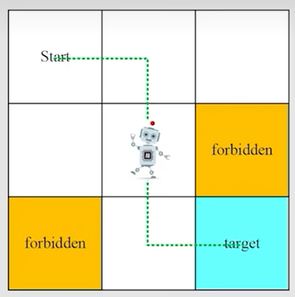
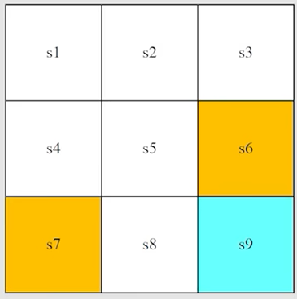
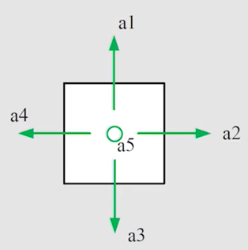
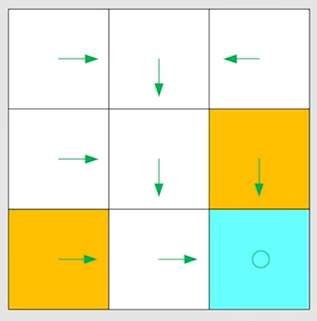
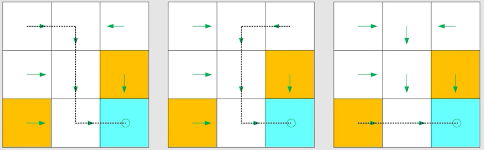
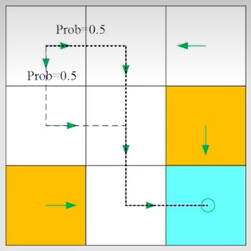
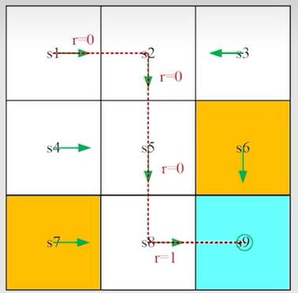
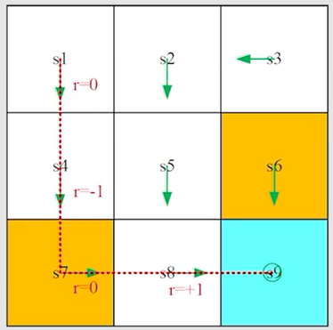

# 第 1 课：基本概念

## 1.1 例子-网格世界

如图所示的**网格世界（grid world）**中，包括以下几个例子：

- **智能体（agent）**：可以在网格世界中移动，但每个时刻只能停留或占据一个单元格。
- **允许进入区域**：网格世界中的白色区域都是智能体 可以自由出入的区域。
- **禁止进入区域**：网格世界中的黄色区域都是智能体禁止进入的区域。
- **目标区域**：网格世界中的蓝色区域，智能体最终需要抵达的区域。

任务：

- 给定任意起始区域，找到一条通往目标的“合适”路径。
- 如何定义“合适”？避开禁入单元、绕路以及边界。

## 1.2 状态

**状态**是指智能体相对于环境所处的情形。

以网格世界为例，智能体所在的位置就是其状态。该环境中共有九个可能的位置，因此可定义九个状态：$$s_1, s_2, \ldots, s_9$$。

状态空间（State space）是所有可能状态构成的集合：

$$
\mathcal{S}=\{s_i\}_{i=1}^{9}=\{s_1,s_2,\ldots,s_9\}
$$

## 1.3 动作

对于每个状态，智能体都有五个可能的动作：

- $$a_1$$：向上移动；
- $$a_2$$：向右移动；
- $$a_3$$：向下移动；
- $$a_4$$：向左移动；
- $$a_5$$：保持原地不动。

状态的动作空间（Action Space）

一个状态的动作空间，是指在该状态下所有可选动作构成的集合。对于状态 $$s_i$$，其动作空间可表示为：

$$
\mathcal{A}(s_i)=\{a_j\}_{j=1}^{5}
$$

在这个网格世界示例中，每个状态都具有相同的五个可选动作。更一般地，不同状态的动作空间可以不同。例如，在边界位置，某些移动动作可能无法执行；或者在特定状态下，环境可能只允许智能体采取部分动作。

## 1.4 状态转移

### 1.4.1 状态转移

智能体执行动作后，可能会从一个状态进入另一个状态，这一过程称为**状态转移（State transition）**。

例如，智能体当前处于状态 $$s_1$$：

- 若选择动作 $$a_2$$，则会转移到状态 $$s_2$$：

$$
s_1 \xrightarrow{a_2} s_2
$$

- 若选择动作 $$a_1$$，则状态保持不变：

$$
s_1 \xrightarrow{a_1} s_1
$$

状态转移刻画了智能体与环境之间的交互过程。不同的动作会带来不同的状态变化，而同一个动作在不同状态下的结果也可能不同。

智能体位于状态 $$s_5$$ （禁止区域）时，若选择动作 $$a_2$$，下一个状态会是什么？

禁止区域通常有两种处理方式：

- **情况一：可以进入禁止区域，但会受到惩罚。**  
  此时，智能体会从 $$s_5$$ 转移到 $$s_6$$：

$$
s_5 \xrightarrow{a_2} s_6
$$

- **情况二：禁止区域不可进入。**  
  例如，该区域被墙壁包围。此时，智能体执行动作后仍留在原状态：

$$
s_5 \xrightarrow{a_2} s_5
$$

下面主要讨论第一种情况。它更一般，也更值得研究：智能体虽然可以进入禁止区域，但必须为此付出代价。

### 1.4.2 表格表示法

状态转移可以用表格表示。表中每一行对应当前状态，每一列对应一个动作，单元格中的内容表示执行该动作后到达的下一个状态。

| 当前状态 | $$a_1$$：向上 | $$a_2$$：向右 | $$a_3$$：向下 | $$a_4$$：向左 | $$a_5$$：原地不动 |
| :------: | :-----------: | :-----------: | :-----------: | :-----------: | :---------------: |
| $$s_1$$  |    $$s_1$$    |    $$s_2$$    |    $$s_4$$    |    $$s_1$$    |      $$s_1$$      |
| $$s_2$$  |    $$s_2$$    |    $$s_3$$    |    $$s_5$$    |    $$s_1$$    |      $$s_2$$      |
| $$s_3$$  |    $$s_3$$    |    $$s_3$$    |    $$s_6$$    |    $$s_2$$    |      $$s_3$$      |
| $$s_4$$  |    $$s_1$$    |    $$s_5$$    |    $$s_7$$    |    $$s_4$$    |      $$s_4$$      |
| $$s_5$$  |    $$s_2$$    |    $$s_6$$    |    $$s_8$$    |    $$s_4$$    |      $$s_5$$      |
| $$s_6$$  |    $$s_3$$    |    $$s_6$$    |    $$s_9$$    |    $$s_5$$    |      $$s_6$$      |
| $$s_7$$  |    $$s_4$$    |    $$s_8$$    |    $$s_7$$    |    $$s_7$$    |      $$s_7$$      |
| $$s_8$$  |    $$s_5$$    |    $$s_9$$    |    $$s_8$$    |    $$s_7$$    |      $$s_8$$      |
| $$s_9$$  |    $$s_6$$    |    $$s_9$$    |    $$s_9$$    |    $$s_8$$    |      $$s_9$$      |

以状态 $$s_1$$ 为例，智能体执行向右动作 $$a_2$$ 后，会转移到状态 $$s_2$$；若执行向上或向左动作，由于已经处在边界，状态保持为 $$s_1$$。

这种表格表示法适用于**确定性状态转移**：给定当前状态和动作后，下一个状态是唯一确定的。

### 1.4.3 状态转移概率

状态转移不仅可以用表格描述，也可以用概率表示。

以状态 $$s_1$$ 为例：智能体选择动作 $$a_2$$ 后，下一个状态为 $$s_2$$。若这一结果是确定的，则有：

$$
p(s_2\mid s_1,a_2)=1
$$

对于其他状态 $$s_i$$，只要 $$i\neq2$$，转移到该状态的概率均为：

$$
p(s_i\mid s_1,a_2)=0,\qquad \forall i\neq2
$$

这对应确定性状态转移：给定当前状态和动作后，下一个状态唯一确定。

不过，实际环境中也可能存在随机性。例如，智能体想向右移动，但受到风力影响后，可能向上或向下偏移。此时，同一状态和动作可能对应多个下一状态，只是各自发生的概率不同。

## 1.5 策略

### 1.5.1 策略

策略规定了智能体在不同状态下应当采取什么动作。图中的绿色箭头就是一种策略的直观表示：每个状态中的箭头，都给出了智能体在该状态下的行动方向。

在这张图中，无论从哪个初始状态出发，智能体都按照同一套箭头规则行动，最终会到达右下角的目标状态。不同的起点会产生不同的轨迹，但它们遵循的是同一个策略。

**确定性策略**可以写为：
$$
a=\pi(s)
$$

即状态 $$s$$ 一旦确定，策略就给出唯一的动作 $$a$$。以状态 $$s_1$$ 为例，图中的策略要求智能体选择向右移动的动作 $$a_2$$

$$
\pi(a_1\mid s_1)=0
$$

$$
\pi(a_2\mid s_1)=1
$$

$$
\pi(a_3\mid s_1)=0
$$

$$
\pi(a_4\mid s_1)=0
$$

$$
\pi(a_5\mid s_1)=0
$$

这是一种确定性策略。在状态 $$s_1$$ 下，动作 $$a_2$$ 会被以概率 $$1$$ 选中，其余动作被选中的概率均为 $$0$$。

**如果策略是随机的**，则用 $$\pi(a\mid s)$$ 表示智能体在状态 $$s$$ 下选择动作 $$a$$ 的概率：
$$
\pi(a\mid s)=P(A_t=a\mid S_t=s)
$$

例如，在状态 $$s_1$$ 下，智能体有相同的概率选择向右动作 $$a_2$$ 或向下动作 $$a_3$$：

$$
\pi(a_1\mid s_1)=0
$$

$$
\pi(a_2\mid s_1)=0.5
$$

$$
\pi(a_3\mid s_1)=0.5
$$

$$
\pi(a_4\mid s_1)=0
$$

$$
\pi(a_5\mid s_1)=0
$$

其中，所有动作的选择概率之和必须为 $$1$$：

$$
\sum_{a\in\mathcal{A}(s_1)}\pi(a\mid s_1)=1
$$

因此，智能体每次处于 $$s_1$$ 时，有 $$0.5$$ 的概率向右移动，也有 $$0.5$$ 的概率向下移动。

### 1.5.2 策略与动作的区别

- **动作空间** $$\mathcal{A}(s)$$ 通常由环境定义。它说明智能体在状态 $$s$$ 下“可以尝试”哪些动作，例如向上、向下、向左、向右或保持不动。
- **动作** $$a$$ 是智能体在某一时刻实际选择并执行的一个动作。也就是说，动作由智能体选出，但必须来自环境给定的动作空间。
- **策略** $$\pi$$ 是智能体的决策规则，它决定在某个状态下如何选择动作。

因此，可以简单理解为：**环境给出可行动作的范围，智能体通过策略从中选择动作。**  
动作影响环境的状态转移；策略则是智能体产生动作的方式。

## 1.6 奖励

### 1.6.1 奖励

**奖励（Reward）**是强化学习中最核心的概念之一。智能体执行动作后，环境会反馈一个实数，称为奖励，通常记为 $$r_{t+1}$$。

正奖励通常表示鼓励，说明这一结果相对更值得追求；负奖励通常表示惩罚，说明这一结果应当尽量避免。

需要注意的是，奖励的正负并不总能直接理解为“奖励”或“惩罚”，关键在于它与其他可选结果的相对大小。

- 奖励为 $$0$$，通常表示没有即时奖励或惩罚，但不代表这个动作一定没有影响。
- 正数奖励也可以起到惩罚作用。例如，若到达目标的奖励是 $$+10$$，进入危险区域的奖励是 $$+1$$，那么 $$+1$$ 虽然为正，却仍是一个明显较差的结果，会使智能体倾向于避开危险区域。

因此，强化学习关心的不是单步奖励的正负，而是在长期交互中获得的累计奖励。

在网格世界中，可以将奖励设定为：

- 智能体尝试越过边界时，给予奖励 $$r_{\text{bound}}=-1$$；
- 智能体尝试进入禁止区域时，给予奖励 $$r_{\text{forbid}}=-1$$；
- 智能体到达目标格 $$s_9$$ 时，给予奖励 $$r_{\text{target}}=+1$$；
- 其余情况下，奖励为 $$r=0$$。

其中，黄色格 $$s_6$$ 和 $$s_7$$ 表示禁止区域，蓝色格 $$s_9$$ 表示目标区域。

奖励可以看作人类向智能体传递目标的一种方式。通过设定不同结果对应的奖励，环境告诉智能体哪些行为值得重复，哪些行为应当避免。

在上述设定下，智能体会逐渐学会避开边界和禁止区域，并设法到达目标状态 $$s_9$$。

### 1.6.2 奖励转移的表格表示

与状态转移类似，奖励也可以用表格表示。表中的行表示当前状态，列表示智能体采取的动作，单元格中的内容表示执行该动作后获得的即时奖励。

| 当前状态 |     $$a_1$$：向上     |     $$a_2$$：向右     |     $$a_3$$：向下     |     $$a_4$$：向左     |   $$a_5$$：原地不动   |
| :------: | :-------------------: | :-------------------: | :-------------------: | :-------------------: | :-------------------: |
| $$s_1$$  | $$r_{\text{bound}}$$  |         $$0$$         |         $$0$$         | $$r_{\text{bound}}$$  |         $$0$$         |
| $$s_2$$  | $$r_{\text{bound}}$$  |         $$0$$         |         $$0$$         |         $$0$$         |         $$0$$         |
| $$s_3$$  | $$r_{\text{bound}}$$  | $$r_{\text{bound}}$$  | $$r_{\text{forbid}}$$ |         $$0$$         |         $$0$$         |
| $$s_4$$  |         $$0$$         |         $$0$$         | $$r_{\text{forbid}}$$ | $$r_{\text{bound}}$$  |         $$0$$         |
| $$s_5$$  |         $$0$$         | $$r_{\text{forbid}}$$ |         $$0$$         |         $$0$$         |         $$0$$         |
| $$s_6$$  |         $$0$$         | $$r_{\text{bound}}$$  | $$r_{\text{target}}$$ |         $$0$$         | $$r_{\text{forbid}}$$ |
| $$s_7$$  |         $$0$$         |         $$0$$         | $$r_{\text{bound}}$$  | $$r_{\text{bound}}$$  | $$r_{\text{forbid}}$$ |
| $$s_8$$  |         $$0$$         | $$r_{\text{target}}$$ | $$r_{\text{bound}}$$  | $$r_{\text{forbid}}$$ |         $$0$$         |
| $$s_9$$  | $$r_{\text{forbid}}$$ | $$r_{\text{bound}}$$  | $$r_{\text{bound}}$$  |         $$0$$         | $$r_{\text{target}}$$ |

例如，智能体位于 $$s_5$$ 时，若执行向右动作 $$a_2$$，将尝试进入禁止区域，因此获得惩罚 $$r_{\text{forbid}}$$；位于 $$s_8$$ 时，若向右移动，则到达目标状态并获得奖励 $$r_{\text{target}}$$。

这张表与前面的确定性状态转移表配合使用：在给定状态和动作后，奖励是唯一确定的。若奖励还取决于实际到达的下一个状态，通常写作 $$r(s,a,s')$$；若奖励本身具有随机性，则需要用概率分布或期望奖励进一步描述。

### 1.6.3 奖励的数学描述：条件概率

奖励也可以用条件概率来描述。

以状态 $$s_1$$ 为例，若智能体选择动作 $$a_1$$，则会获得奖励 $$-1$$。在当前设定下，这个结果是确定的：

$$
p(r=-1\mid s_1,a_1)=1
$$

对于任意不等于 $$-1$$ 的奖励值，其发生概率为：

$$
p(r\neq-1\mid s_1,a_1)=0
$$

这对应确定性的奖励机制：当前状态和动作一旦确定，奖励也随之确定。

但在许多实际问题中，奖励具有随机性。比如，认真学习通常会带来收获，但具体能取得多大的进步并不确定。同样地，智能体在状态 $$s$$ 下执行动作 $$a$$ 后，可能获得不同的奖励值，并且每种奖励值都有相应的概率。

在更一般的情形下，可以用 $$p(r\mid s,a)$$ 表示：智能体处于状态 $$s$$、采取动作 $$a$$ 时，获得奖励 $$r$$ 的概率。

### 1.6.4 轨迹与回报

一条**轨迹**（trajectory）描述了智能体在环境中的连续交互过程。它由状态、动作和奖励依次构成：

$$
s_1 \xrightarrow[\ r=0\ ]{a_2} s_2
\xrightarrow[\ r=0\ ]{a_3} s_5
\xrightarrow[\ r=0\ ]{a_3} s_8
\xrightarrow[\ r=1\ ]{a_2} s_9
$$

在这条轨迹中，智能体从 $$s_1$$ 出发，依次经过 $$s_2$$、$$s_5$$ 和 $$s_8$$，最终到达目标状态 $$s_9$$。

一条轨迹的**回报**（return）是该轨迹中获得的所有奖励之和：

$$
G=0+0+0+1=1
$$

这里的回报为 $$1$$。它衡量的是智能体沿着整条轨迹最终获得了多少收益，而不只看某一步的即时奖励。

策略改变后，即使从同一个初始状态出发，智能体也可能走出完全不同的路径。

例如，智能体从状态 $$s_1$$ 出发，按照另一种策略行动：

$$
s_1 \xrightarrow[\ r=0\ ]{a_3} s_4
\xrightarrow[\ r=-1\ ]{a_3} s_7
\xrightarrow[\ r=0\ ]{a_2} s_8
\xrightarrow[\ r=1\ ]{a_2} s_9
$$

在这条轨迹中，智能体从 $$s_4$$ 向下进入了禁止区域 $$s_7$$，因此受到一次奖励为 $$-1$$ 的惩罚。之后，它继续前往目标状态 $$s_9$$，获得奖励 $$+1$$。

这条轨迹的回报为：

$$
G=0-1+0+1=0
$$

虽然智能体最终到达了目标，但由于中途进入了禁止区域，回报低于上一条轨迹的 $$1$$。这说明，强化学习不仅关注是否完成任务，也关注以什么方式完成任务。

**哪个策略更好？**

从直观上看，第一种策略更好，因为它避开了禁止区域，并以更安全的路径到达目标。

从回报来看，第一种策略的表现也更好：

$$
G_1=1
$$

$$
G_2=0
$$

由于第一条轨迹的回报更高，因此对应的第一种策略更优。

回报为比较和评价策略提供了一个量化标准。在强化学习中，智能体希望学习到的正是能够获得更高长期回报的策略。

### 1.6.5 折扣回报

前面的回报定义是将轨迹中的所有奖励直接相加。但一条轨迹不一定会结束，它可能是无限长的。

例如，智能体到达目标状态 $$s_9$$ 后，持续执行原地不动的动作 $$a_5$$：

$$
s_1 \xrightarrow{a_2} s_2
\xrightarrow{a_3} s_5
\xrightarrow{a_3} s_8
\xrightarrow{a_2} s_9
\xrightarrow{a_5} s_9
\xrightarrow{a_5} s_9
\cdots
$$

若每次停留在目标状态 $$s_9$$ 都获得奖励 $$1$$，则总回报为：

$$
G=0+0+0+1+1+1+\cdots=\infty
$$

此时，直接累加奖励的定义不再适用，因为回报会发散。

为处理无限长轨迹，强化学习通常采用**折扣回报（Discounted Return）**：距离当前时刻越远的奖励，权重越小。折扣回报将在后面正式定义。

为使无限长轨迹的回报保持有限，需要引入折扣率 $$\gamma$$：

$$
\gamma\in[0,1)
$$

对于前面的轨迹，其奖励序列为 $$0,0,0,1,1,\ldots$$。折扣回报为：

$$
G=0+\gamma\cdot0+\gamma^2\cdot0+\gamma^3\cdot1+\gamma^4\cdot1+\gamma^5\cdot1+\cdots
$$

因此：

$$
G=\gamma^3(1+\gamma+\gamma^2+\cdots)=\frac{\gamma^3}{1-\gamma}
$$

由于 $$\gamma<1$$，上式是有限的。

折扣率有两个作用：

1. 使无限长轨迹的回报不再发散；
2. 平衡即时奖励与未来奖励的重要性。

当 $$\gamma$$ 接近 $$0$$ 时，智能体更重视近期奖励；当 $$\gamma$$ 接近 $$1$$ 时，智能体会更加重视较远未来的奖励。

## 1.7 回合

智能体按照某一策略与环境交互时，可能会在某个终止状态（terminal state）停止。由初始状态开始，到终止状态结束的完整轨迹，称为一个**回合（episode）**，也常称为一次试验。

例如，在网格世界中，智能体从 $$s_1$$ 出发，最终到达目标状态 $$s_9$$：

$$
s_1 \xrightarrow[\ r=0\ ]{a_2} s_2
\xrightarrow[\ r=0\ ]{a_3} s_5
\xrightarrow[\ r=0\ ]{a_3} s_8
\xrightarrow[\ r=1\ ]{a_2} s_9
$$

这里，$$s_9$$ 是终止状态。智能体到达该状态后，本回合结束，不再继续选择动作。

通常，一个回合被视为有限长度的轨迹。具有明确起点和终止条件的强化学习问题，称为**回合式任务**（episodic task）。

有些任务没有终止状态，智能体与环境的交互不会结束。这类任务称为**持续性任务**。

例如，在网格世界中，智能体到达目标状态后，是否一定要停止？不一定。通过适当建模，回合式任务也可以转化为持续性任务，从而用统一的数学框架处理。

常见的处理方式有两种：

- **将目标状态视为吸收状态。**  
  智能体一旦到达目标状态，就无法再离开；此后每一步的奖励均为 $$r=0$$。

- **将目标状态视为普通状态。**  
  智能体到达目标状态后仍可继续执行动作并离开该状态；每当它进入目标状态时，获得奖励 $$r=+1$$。

赵老师的课程采用第二种方式。这样，目标状态不需要被单独处理，它与其他状态一样参与状态转移和策略决策。

需要注意的是，在这种设定下，智能体可能多次进入目标状态，因此通常需要使用折扣回报来衡量长期收益。

## 1.8 马尔可夫决策过程

前面介绍的状态、动作、奖励、状态转移和策略，可以统一放在**马尔可夫决策过程**（Markov Decision Process，MDP）的框架下描述。

### 1.8.1 集合

- **状态空间**：所有可能状态构成的集合，记为 $$\mathcal{S}$$。
- **动作空间**：对于每个状态 $$s\in\mathcal{S}$$，环境给出可选动作集合 $$\mathcal{A}(s)$$。
- **奖励集合**：在状态 $$s$$ 下采取动作 $$a$$ 后，可能获得的奖励构成的集合，可记为 $$\mathcal{R}(s,a)$$。

### 1.8.2 概率分布

- **状态转移概率**：智能体处于状态 $$s$$ 并执行动作 $$a$$ 后，转移到下一状态 $$s'$$ 的概率：

$$
p(s'\mid s,a)
$$

- **奖励概率**：智能体处于状态 $$s$$ 并执行动作 $$a$$ 后，获得奖励 $$r$$ 的概率：

$$
p(r\mid s,a)
$$

### 1.8.3 策略

策略描述智能体在状态 $$s$$ 下选择动作 $$a$$ 的概率：

$$
\pi(a\mid s)
$$

### 1.8.4 马尔可夫性质

MDP 的关键假设是**马尔可夫性**，也称无记忆性：下一时刻的状态和奖励，只由当前状态与当前动作决定，而不依赖更早的历史信息。

$$
p(s_{t+1}\mid s_t,a_t,\ldots,s_0,a_0)=p(s_{t+1}\mid s_t,a_t)
$$

$$
p(r_{t+1}\mid s_t,a_t,\ldots,s_0,a_0)=p(r_{t+1}\mid s_t,a_t)
$$

因此，只要当前状态 $$s_t$$ 已经完整描述了与未来决策相关的信息，智能体就无需记住完整的历史轨迹。
