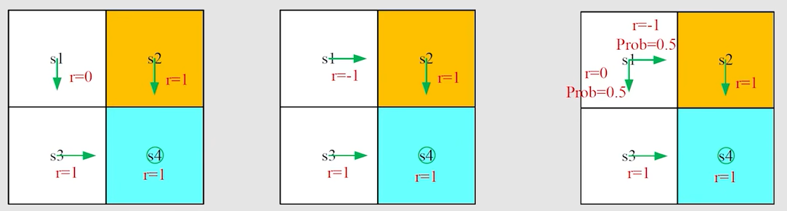
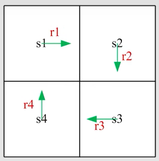
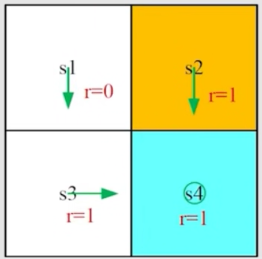
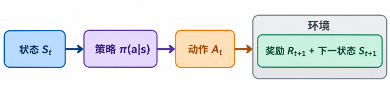
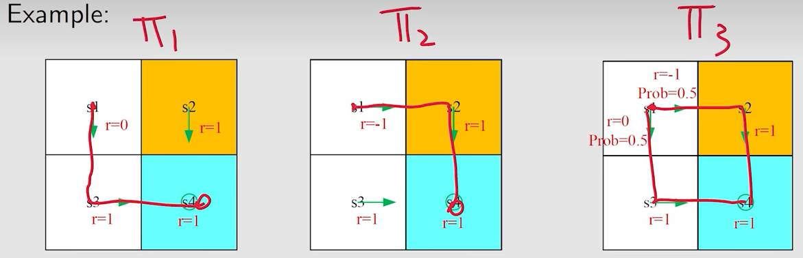
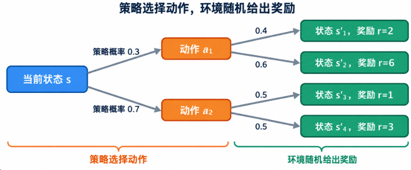
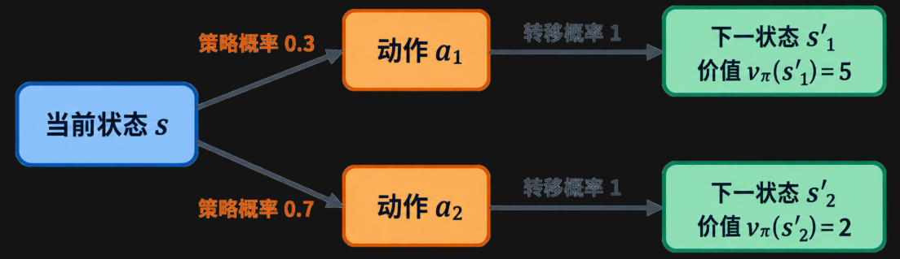
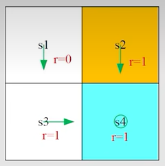

# 第 2 课：贝尔曼公式

## 2.1 Motivation Examples

### 2.1.1 return 为什么重要?

**return 能够告诉我们哪个策略好哪个策略坏**

请看下面一个例子，从起始点 $s_1$，哪个策略更好？

直观上来看：

- 左边策略：从状态 $s_1$ 出发并不会进入禁区 $s_2$，轨迹为 $s_1 → s_3 → s_4 → s_4...$ ，回报最大，策略最好
- 中间策略：从状态 $s_1$ 出发一定会进入禁区 $s_2$，轨迹为 $s_1 → s_2 → s_4 → s_4...$ ，回报最小，策略最差
- 右边策略：从状态 $s_1$ 出发可能会进入禁区 $s_2$，存在两条轨迹，分别为 $s_1 → s_2 → s_4 → s_4...$ 和 $s_1 → s_3 → s_4 → s_4...$ ，回报一般

### 2.1.2 如何计算 return？

我们通常使用 $v_i$ 来表示从 $s_i$ 出发所得到的 return

- **定义法：return 定义为沿轨迹收集的所有奖励的折扣总和。**

$$
v_1=r_1+\gamma r_2+\gamma^2 r_3+... \\
v_2=r_2+\gamma r_3+\gamma^2 r_4+... \\
v_3=r_3+\gamma r_4+\gamma^2 r_1+... \\
v_4=r_4+\gamma r_1+\gamma^2 r_2+... \\
$$

- **自举法（bootstrapping）：我们可以将定义法中的等式进行变换**

$$
v_1=r_1+\gamma( r_2+\gamma r_3+...)=r_1 + \gamma v_2 \\
v_2=r_2+\gamma( r_3+\gamma r_4+...)=r_2 + \gamma v_3 \\
v_3=r_3+\gamma( r_4+\gamma r_1+...)=r_3 + \gamma v_4 \\
v_4=r_4+\gamma( r_1+\gamma r_2+...)=r_4 + \gamma v_1 \\
$$

把它写成矩阵的形式

$$
\underbrace{
\begin{bmatrix}
v_1\\
v_2\\
v_3\\
v_4
\end{bmatrix}
}_{\mathbf v} =
\underbrace{
\begin{bmatrix}
r_1\\
r_2\\
r_3\\
r_4
\end{bmatrix}
}_{\mathbf r}
+
\gamma
\underbrace{
\begin{bmatrix}
0&1&0&0\\
0&0&1&0\\
0&0&0&1\\
1&0&0&0
\end{bmatrix}
}_{\mathbf P}
\underbrace{
\begin{bmatrix}
v_1\\
v_2\\
v_3\\
v_4
\end{bmatrix}
}_{\mathbf v}
$$

最终可以写为

$$
\mathbf{v}=\mathbf{r}+\gamma\mathbf{P}\mathbf{v}
$$

这就是**贝尔曼方程**，其中 $\mathbf{P}$ 是状态转移矩阵，它描述的是在给定策略后，从当前状态转移至下一个状态的概率。由贝尔曼方程移项并提取 $\mathbf{v}$，可以求解得到：

$$
\boxed{
\mathbf v=(\mathbf I-\gamma\mathbf P)^{-1}\mathbf r
}
$$

### 2.1.3 Example

考虑下面一个例子，写出 returns 之间的关系

答案

$$
v_1=0 + \gamma v_3 \\
v_2=1 + \gamma v_4 \\
v_3=1 + \gamma v_4 \\
v_4=1 + \gamma v_4 \\
$$

## 2.2 State Value

### 2.2.1 单步过程

考虑一个单步过程：

$$
S_t \xrightarrow{A_t} R_{t+1},\, S_{t+1}
$$

- $t,\, t+1$：离散时间点
- $S_t$：时间点 $t$ 的状态
- $A_t$：在状态 $S_t$ 下采取的动作
- $R_{t+1}$：采取动作 $A_t$ 后获得的奖励
- $S_{t+1}$：采取动作 $A_t$ 后转移到的状态

> $S_t$、$A_t$、$R_{t+1}$ 都是随机变量

这一步的演化由以下概率分布决定：

- 状态 $S_t$ 到动作 $A_t$ 的选择，由策略 $\pi(A_t=a\mid S_t=s)$ 决定。

​	$a$ 是**动作空间**中的一个具体动作；动作空间通常由环境/任务定义，例如“上、下、左、右”。

​	$\pi(A_t=a\mid S_t=s)$ 决定：在状态 $s$ 下，选择动作 $a$ 的概率。

- 给定状态 $S_t$ 和动作 $A_t$ 后，获得奖励 $R_{t+1}$ 的概率由 $p(R_{t+1}=r\mid S_t=s,A_t=a)$ 决定

- 给定状态 $S_t$ 和动作 $A_t$ 后，转移到下一状态 $S_{t+1}$ 的概率由 $p(S_{t+1}=s'\mid S_t=s,A_t=a)$ 决定

### 2.2.2 多步轨迹

考虑一个多步的轨迹：

$$
S_t \xrightarrow{A_t} R_{t+1}, S_{t+1}
\xrightarrow{A_{t+1}} R_{t+2}, S_{t+2}
\xrightarrow{A_{t+2}} R_{t+3}, \ldots
$$

折扣回报（discounted return）为：

$$
G_t=R_{t+1}+\gamma R_{t+2}+\gamma^2 R_{t+3}+\cdots
$$

- $\gamma\in[0,1)$ 是折扣因子。

- $G_t$ 也是一个随机变量，因为 $R_{t+1},R_{t+2},\ldots$ 都是随机变量。

### 2.2.3 State Value

回报 $G_t$ 的期望（也称为期望值或均值）被定义为**状态价值函数**（state-value function），简称**状态价值**：

$$
v_\pi(s)=\mathbb{E}[G_t\mid S_t=s]
$$

- $v_\pi(s)$ 是状态 $s$ 的函数。它是一个条件期望：条件是当前状态为 $s$，即 $S_t=s$。

- 状态价值依赖于策略 $\pi$。对于不同的策略，同一个状态的价值可能不同。

- 它表示一个状态的“价值”。在相同状态下进行比较时，如果某个策略对应的状态价值更高，通常说明该策略能够获得更高的期望累计回报。

**Q：return 和 state value 之间的关系是什么**

**A：return 是针对单个 trajectory 求的 return，state value 是针对多个 trajectory 得到 return 再求平均。如果从一个状态出发，一切都是确定性的，只能够得到一个 trajectory，那么 return 和 state value 在数值上是相同的**

### 2.2.4 Example

$$
v_{\pi_1}(s_1)
= 0+\gamma\cdot 1+\gamma^2\cdot 1+\cdots
= \gamma(1+\gamma+\gamma^2+\cdots)
= \frac{\gamma}{1-\gamma}
$$

$$
v_{\pi_2}(s_1)
= -1+\gamma\cdot 1+\gamma^2\cdot 1+\cdots
= -1+\gamma(1+\gamma+\gamma^2+\cdots)
= -1+\frac{\gamma}{1-\gamma}
$$

$$
v_{\pi_3}(s_1)
= 0.5\left(-1+\frac{\gamma}{1-\gamma}\right)
+0.5\left(\frac{\gamma}{1-\gamma}\right)
= -0.5+\frac{\gamma}{1-\gamma}
$$

## 2.3 Bellman equation: Derivation

### 2.3.1 推导

考虑一个随机的轨迹

$$
S_t \xrightarrow{A_t} R_{t+1}, S_{t+1}
\xrightarrow{A_{t+1}} R_{t+2}, S_{t+2}
\xrightarrow{A_{t+2}} R_{t+3}, \ldots
$$

回报 $G_t$ 可以被写为：

$$
\begin{aligned}
G_t
&= R_{t+1}+\gamma R_{t+2}+\gamma^2R_{t+3}+\cdots \\
&= R_{t+1}+\gamma\left(R_{t+2}+\gamma R_{t+3}+\cdots\right) \\
&= R_{t+1}+\gamma G_{t+1}.
\end{aligned}
$$

根据状态价值的定义，可得：

$$
\begin{aligned}
v_\pi(s)
&= \mathbb{E}[G_t\mid S_t=s] \\
&= \mathbb{E}[R_{t+1}+\gamma G_{t+1}\mid S_t=s] \\
&= \mathbb{E}[R_{t+1}\mid S_t=s]
{}+ \gamma\mathbb{E}[G_{t+1}\mid S_t=s].
\end{aligned}
$$

接下来需要分别计算 $\mathbb{E}[R_{t+1}\mid S_t=s]$ 和 $\mathbb{E}[G_{t+1}\mid S_t=s]$

- $\mathbb{E}[R_{t+1}\mid S_t=s]$

$$
\begin{aligned}
\mathbb{E}[R_{t+1}\mid S_t=s]
&= \sum_a \pi(a\mid s)\,
\mathbb{E}[R_{t+1}\mid S_t=s,A_t=a] \\
&= \sum_a \pi(a\mid s)\sum_r p(r\mid s,a)\,r.
\end{aligned}
$$

这一项是 **即时奖励的期望**。

为了便于理解，图中展示的是状态 $s$ 下的一步奖励期望

首先，分别计算采取两个动作后的期望奖励：

$$
\begin{aligned}
\mathbb{E}[R_{t+1}\mid S_t=s,A_t=a_1]
&= 0.4\times 2+0.6\times 6 \\
&= 4.4
\end{aligned}
$$

$$
\begin{aligned}
\mathbb{E}[R_{t+1}\mid S_t=s,A_t=a_2]
&= 0.5\times 1+0.5\times 3 \\
&= 2
\end{aligned}
$$

接着，根据策略对动作的选择概率进行加权：

$$
\begin{aligned}
\mathbb{E}[R_{t+1}\mid S_t=s]
&= \sum_a\pi(a\mid s)\mathbb{E}[R_{t+1}\mid S_t=s,A_t=a] \\
&= 0.3\times 4.4+0.7\times 2 \\
&= 2.72
\end{aligned}
$$

因此，在状态 $s$ 下，智能体执行策略 $\pi$ 时获得的一步期望奖励为 $2.72$。

如果还不能理解第一项，可以尝试理解下面的式子。计算结果是相同的

第一项只关注**眼前这一步**。

智能体当前位于状态 s 时，策略会以概率 $\pi(a\mid s)$ 选择动作 a。执行动作后，环境可能以概率 $p(s'\mid s,a)$ 转移到不同的下一状态 $s'$，每种转移对应一个即时奖励 $r(s,a,s')$。

因此，第一项做的事情就是：把所有“动作—转移—奖励”的可能结果，按照它们发生的概率进行加权平均。

$$
\mathbb{E}[R_{t+1}\mid S_t=s]
{}=
\sum_a \pi(a\mid s)
\sum_{s'}p(s'\mid s,a)\,r(s,a,s')
$$

-  $\mathbb{E}[G_{t+1}\mid S_t=s]$

第二项是在当前状态 $s$ 下，按照策略选择动作并发生状态转移后，对所有可能的下一状态 $s'$ 的**未来回报（状态价值）**进行概率加权平均。

$$
\begin{aligned}
\mathbb{E}[G_{t+1}\mid S_t=s]
&= \sum_{s'}
\mathbb{E}[G_{t+1}\mid S_t=s,S_{t+1}=s']\,p(s'\mid s) \\
&= \sum_{s'}
\mathbb{E}[G_{t+1}\mid S_{t+1}=s']\,p(s'\mid s) \\
&= \sum_{s'}v_\pi(s')p(s'\mid s) \\
&= \sum_{s'}v_\pi(s')\sum_a p(s'\mid s,a)\pi(a\mid s).
\end{aligned}
$$

注意：

- 这一项表示未来回报的期望值。

- 根据马尔可夫性质，在已知下一状态 $S_{t+1}=s'$ 后，未来回报 $G_{t+1}$ 与此前的状态 $S_t=s$ 无关。因此：

$$
\mathbb{E}[G_{t+1}\mid S_t=s,S_{t+1}=s']
{}=
\mathbb{E}[G_{t+1}\mid S_{t+1}=s']=v_\pi(s').
$$

同样，为了便于理解，请看下图

图中，策略在状态 $s$ 下以概率 $0.3$ 选择动作 $a_1$，以概率 $0.7$ 选择动作 $a_2$。

- 选择 $a_1$ 后，环境以概率 $1$ 转移到 $s'_1$，且 $v_\pi(s'_1)=5$。
- 选择 $a_2$ 后，环境以概率 $1$ 转移到 $s'_2$，且 $v_\pi(s'_2)=2$。

因此，在策略 $\pi$ 下的状态转移概率为：

$$
\begin{aligned}
p(s'_1\mid s)
&= \pi(a_1\mid s)p(s'_1\mid s,a_1) \\
&= 0.3\times 1=0.3 \\
p(s'_2\mid s)
&= \pi(a_2\mid s)p(s'_2\mid s,a_2) \\
&= 0.7\times 1=0.7
\end{aligned}
$$

第二项，即到达下一状态后的未来价值期望为：

$$
\begin{aligned}
\mathbb{E}[G_{t+1}\mid S_t=s]
&= \sum_{s'}v_\pi(s')p(s'\mid s) \\
&= v_\pi(s'_1)p(s'_1\mid s)
+v_\pi(s'_2)p(s'_2\mid s) \\
&= 5\times 0.3+2\times 0.7 \\
&= 2.9
\end{aligned}
$$

也就是说，虽然每个动作的状态转移是确定的，但由于策略会随机选择动作，下一状态以及未来价值仍然是随机的。

如果还不能理解第二项，可以尝试理解下面的式子。计算结果是相同的

第二项关注的是**当前动作之后的长期收益**。

策略先按 $\pi(a\mid s)$ 选择动作，环境再按 $p(s'\mid s,a)$ 转移到下一状态 $s'$。到达 $s'$ 后，未来能够获得的期望累计回报就是该状态的价值 $v_\pi(s')$。

因此，第二项做的事情是：对所有可能到达的下一状态价值 $v_\pi(s')$，按照到达它们的概率进行加权平均。

$$
\mathbb{E}[G_{t+1}\mid S_t=s]
{}=
\sum_a \pi(a\mid s)
\sum_{s'} p(s'\mid s,a)v_\pi(s')
$$

因此，我们有：

$$
\begin{aligned}
v_\pi(s)
&= \mathbb{E}[R_{t+1}\mid S_t=s]
{}+ \gamma\mathbb{E}[G_{t+1}\mid S_t=s] \\
&= \underbrace{
\sum_a \pi(a\mid s)\sum_r p(r\mid s,a)\,r
}_{\text{即时奖励的期望}}
+
\gamma\underbrace{
\sum_a \pi(a\mid s)\sum_{s'}p(s'\mid s,a)\,v_\pi(s')
}_{\text{未来价值的期望}} \\
&= \sum_a\pi(a\mid s)
\left[
\sum_r p(r\mid s,a)\,r
+
\gamma\sum_{s'}p(s'\mid s,a)\,v_\pi(s')
\right],
\qquad \forall s\in\mathcal{S}.
\end{aligned}
$$

当然刚才我们自己也通过理解推导出两项的计算方式，所以贝尔曼方程也可以写成

$$
\begin{aligned}
v_\pi(s)
&= \mathbb{E}[R_{t+1}\mid S_t=s]
{}+ \gamma\mathbb{E}[G_{t+1}\mid S_t=s] \\
&= \underbrace{
\sum_a\pi(a\mid s)
\sum_{s'}p(s'\mid s,a)\,r(s,a,s')
}_{\text{即时奖励的期望}}
+
\gamma\underbrace{
\sum_a\pi(a\mid s)
\sum_{s'}p(s'\mid s,a)\,v_\pi(s')
}_{\text{未来价值的期望}} \\
&= \sum_a\pi(a\mid s)
\sum_{s'}p(s'\mid s,a)
\left[
r(s,a,s')+\gamma v_\pi(s')
\right],
\qquad \forall s\in\mathcal{S}.
\end{aligned}
$$

重点：

- 上述方程称为**贝尔曼方程**（Bellman equation），它刻画了不同状态之间状态价值函数的关系。
- 它由两部分组成：**即时奖励项**和**未来价值项**。
- 它是一组方程：状态空间中的每一个状态 $s$ 都有一个对应的贝尔曼方程。
-  $v_\pi(s)$ 和 $v_\pi(s')$ 是需要计算的状态价值。这里体现了**自举（Bootstrapping）**思想：使用下一状态的价值估计当前状态的价值。
- $\pi(a\mid s)$ 是给定的策略。求解该方程的过程称为**策略评估**（policy evaluation）。
- $p(r\mid s,a)$ 和 $p(s'\mid s,a)$ 表示环境的动态模型（dynamic model）。

### 2.3.2 Example

由于策略是确定性的，因此该例子较为简单。

首先，考虑状态 $s_1$ 的状态价值：

- $\pi(a=a_3\mid s_1)=1$，且 $\pi(a\ne a_3\mid s_1)=0$。

- $p(s'=s_3\mid s_1,a_3)=1$，且 $p(s'\ne s_3\mid s_1,a_3)=0$。

- $p(r=0\mid s_1,a_3)=1$，且 $p(r\ne 0\mid s_1,a_3)=0$。

将这些条件代入贝尔曼期望方程，可得：

$$
\begin{aligned}
v_\pi(s_1) &= 0+\gamma v_\pi(s_3), \\
v_\pi(s_2) &= 1+\gamma v_\pi(s_4), \\
v_\pi(s_3) &= 1+\gamma v_\pi(s_4), \\
v_\pi(s_4) &= 1+\gamma v_\pi(s_4).
\end{aligned}
$$

通过求解可得：

$$
\begin{aligned}
v_\pi(s_4) &= \frac{1}{1-\gamma}, \\
v_\pi(s_3) &= \frac{1}{1-\gamma}, \\
v_\pi(s_2) &= \frac{1}{1-\gamma}, \\
v_\pi(s_1) &= \frac{\gamma}{1-\gamma}.
\end{aligned}
$$

## 2.4 Bellman equation: Matrix-vector form
