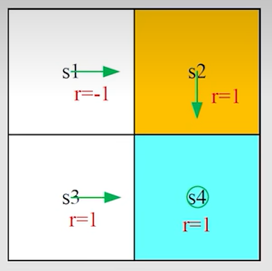
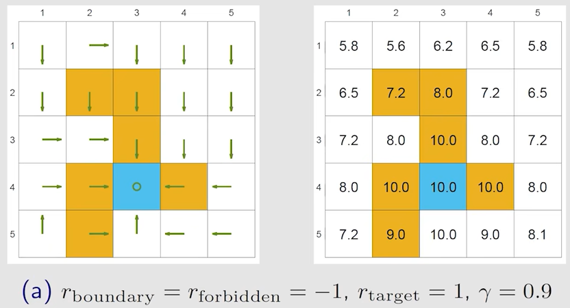
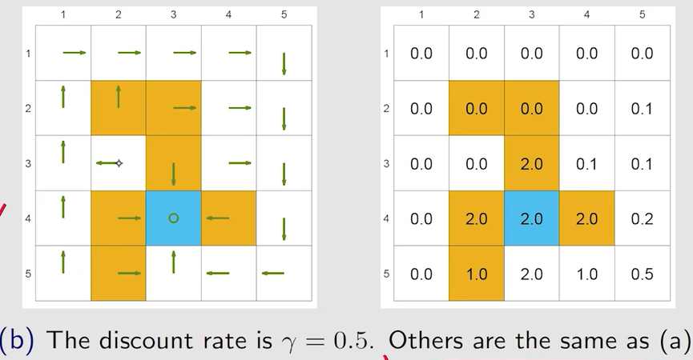
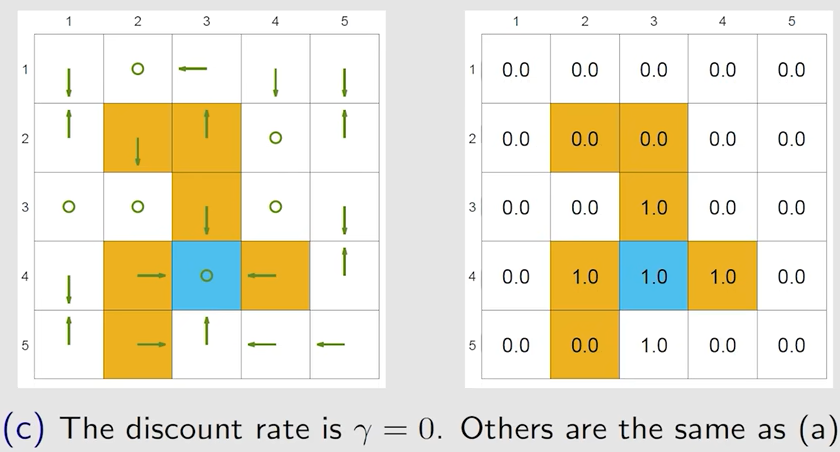
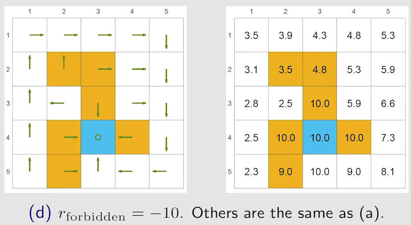
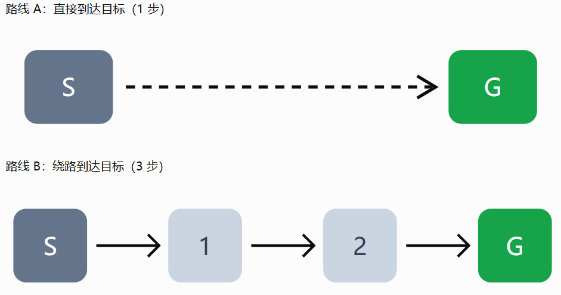

# 第 3 课：贝尔曼最优公式

## 3.1 Motivation examples

贝尔曼方程：

$$
\begin{aligned}
v_\pi(s_1) &= -1+\gamma v_\pi(s_2), \\
v_\pi(s_2) &= 1+\gamma v_\pi(s_4), \\
v_\pi(s_3) &= 1+\gamma v_\pi(s_4), \\
v_\pi(s_4) &= 1+\gamma v_\pi(s_4).
\end{aligned}
$$

状态价值：令 $\gamma=0.9$，则可以计算得到：

$$
v_\pi(s_4)
{}=
v_\pi(s_3)
{}=
v_\pi(s_2)
{}=
10,
\qquad
v_\pi(s_1)=8.
$$
动作价值：考虑状态 $s_1$
$$
\begin{aligned}
q_\pi(s_1,a_1) &= -1+\gamma v_\pi(s_1)=6.2, \\
q_\pi(s_1,a_2) &= -1+\gamma v_\pi(s_2)=8, \\
q_\pi(s_1,a_3) &= 0+\gamma v_\pi(s_3)=9, \\
q_\pi(s_1,a_4) &= -1+\gamma v_\pi(s_1)=6.2, \\
q_\pi(s_1,a_5) &= 0+\gamma v_\pi(s_1)=7.2.
\end{aligned}
$$

问题：当前策略并不理想，如何改进它？

答案：利用动作价值。

当前策略 $\pi(a\mid s_1)$ 为：

$$
\pi(a\mid s_1)
{}=
\begin{cases}
1, & a=a_2, \\
0, & a\ne a_2.
\end{cases}
$$
观察刚刚计算得到的动作价值：

$$
\begin{aligned}
q_\pi(s_1,a_1)&=6.2, &
q_\pi(s_1,a_2)&=8, &
q_\pi(s_1,a_3)&=9, \\
q_\pi(s_1,a_4)&=6.2, &
q_\pi(s_1,a_5)&=7.2.
\end{aligned}
$$

如果选择动作价值最大的动作，就可以得到一个新策略：

$$
\pi_{\text{new}}(a\mid s_1)
{}=
\begin{cases}
1, & a=a^*, \\
0, & a\ne a^*.
\end{cases}
$$

其中：

$$
a^*
{}=
\arg\max_a q_\pi(s_1,a)
{}=
a_3.
$$
**为什么选择动作价值最大的动作可以改进策略？**

直觉上，动作价值 $q_\pi(s,a)$ 衡量的是：

> 当前处于状态 $s$ 时，先执行动作 $a$，之后继续按照原策略 $\pi$ 行动，能够获得的期望累计回报。

因此，在同一个状态 $s$ 下，动作价值越大，说明“第一步选择该动作”带来的长期回报越高。

原策略的状态价值，本质上是各个动作价值按照策略概率的加权平均：

$$
v_\pi(s)
{}=
\sum_a\pi(a\mid s)q_\pi(s,a).
$$

而一组数的加权平均不可能大于其中的最大值，因此：

$$
v_\pi(s)
\le
\max_a q_\pi(s,a).
$$

所以，如果我们在每个状态都选择动作价值最大的动作：

$$
\pi_{\text{new}}(s)
{}=
\arg\max_a q_\pi(s,a),
$$

那么新策略在当前状态下的“一步决策”至少不会比原策略更差。

需要注意的是，$q_\pi(s,a)$ 的含义是“先执行 $a$，之后仍按照旧策略 $\pi$ 行动”的回报。因此，贪心地选择最大动作价值，保证新策略不会变差；当存在更优动作时，策略通常会得到改进。

更严格地，策略改进定理指出：

$$
v_{\pi_{\text{new}}}(s)
\ge
v_\pi(s),
\qquad
\forall s\in\mathcal{S}.
$$

这就是策略改进的核心思想：先评估当前策略，再根据动作价值选择更好的动作，然后重复这一过程。

## 3.2 Definition of optimal policy

状态价值可以用于判断一个策略是否更好。

如果对于所有状态 $s\in\mathcal{S}$，都有：

$$
v_{\pi_1}(s)\ge v_{\pi_2}(s),
$$

那么可以认为策略 $\pi_1$ 至少不比策略 $\pi_2$ 差；当某些状态上严格大于时，$\pi_1$ 可以认为优于 $\pi_2$。

> 定义
>
> 如果对于任意其他策略 $\pi$ 和任意状态 $s$，都有：
>
> $$
> v_{\pi^*}(s)\ge v_\pi(s),
> $$
>
> 则称策略 $\pi^*$ 为**最优策略**（optimal policy）。

这个定义会带来一些问题：

- 最优策略是否一定存在？
- 最优策略是否唯一？
- 最优策略是随机策略，还是确定性策略？
- 如何求得最优策略？

为了回答这些问题，接下来需要学习**贝尔曼最优方程**（Bellman optimality equation）。

## 3.3 BOE: Introduction

### 3.3.1 逐元素形式

$$
\begin{aligned}
v^*(s)
&=
\max_\pi
\sum_a\pi(a\mid s)
\left[
\sum_r p(r\mid s,a)\,r
{}+
\gamma\sum_{s'}p(s'\mid s,a)v^*(s')
\right] \\
&=
\max_\pi
\sum_a\pi(a\mid s)q^*(s,a),
\qquad
\forall s\in\mathcal{S}.
\end{aligned}
$$

我们需要先解决优化问题

备注：

- $p(r\mid s,a)$ 和 $p(s'\mid s,a)$ 是已知的环境模型。

- $v^*(s)$ 和 $v^*(s')$ 是未知量，需要计算。

- 在贝尔曼最优方程中，策略 $\pi$ 不再是预先给定的策略，而是需要通过 $\max_\pi$ 优化的对象。

### 3.3.2 矩阵向量形式

$$
\mathbf{v}
{}=
\max_\pi
\left(
\mathbf{r}_\pi
{}+
\gamma\mathbf{P}_\pi\mathbf{v}
\right).
$$

其中，与状态 $s$ 或下一状态 $s'$ 对应的向量、矩阵元素为：

$$
[\mathbf{r}_\pi]_s
\triangleq
\sum_a\pi(a\mid s)
\sum_r p(r\mid s,a)\,r.
$$

$$
[\mathbf{P}_\pi]_{s,s'}
{}=
p_\pi(s'\mid s)
\triangleq
\sum_a\pi(a\mid s)p(s'\mid s,a).
$$

这里的 $\max_\pi$ 是逐元素进行的：对于每一个状态 $s$，都选择能够使该状态价值最大的动作或策略。

贝尔曼最优方程（BOE）既精妙，又具有一定难度。

- 为什么说它精妙？

  它用一个紧凑的方程，同时描述了最优策略和最优状态价值。

- 为什么说它难？

  方程右侧包含最大化操作，因此不像普通线性方程那样可以直接求解。

- 仍有许多问题需要回答：

  - **算法问题**：如何求解这个方程？
  - **存在性问题**：这个方程是否存在解？
  - **唯一性问题**：这个方程的解是否唯一？
  - **最优性问题**：该方程的解与最优策略之间有什么关系？

## 3.4 BOE: Maximization on right-hand side

**贝尔曼最优方程：逐元素形式**
$$
v^*(s)
{}=
\max_\pi
\sum_a\pi(a\mid s)
\left(
\sum_r p(r\mid s,a)\,r
{}+
\gamma\sum_{s'}p(s'\mid s,a)v^*(s')
\right),
\qquad
\forall s\in\mathcal{S}.
$$

**贝尔曼最优方程：矩阵—向量形式**
$$
\mathbf{v}
{}=
\max_\pi
\left(
\mathbf{r}_\pi
{}+
\gamma\mathbf{P}_\pi\mathbf{v}
\right).
$$

> 示例：如何从一个方程中求解两个未知量
>
> 考虑两个实数变量 $x,a\in\mathbb{R}$。假设它们满足：
>
> $$
> x
> {}=
> \max_a
> \left(
> 2x-1-a^2
> \right).
> $$
>
> 该方程中包含两个未知量。为求解它，先观察右侧。
>
> 无论 $x$ 取何值，由于 $-a^2\le 0$，都有：
>
> $$
> \max_a(2x-1-a^2)
> {}=
> 2x-1.
> $$
>
> 当 $a=0$ 时，上述最大值取得。
>
> 将 $a=0$ 代回原方程：
>
> $$
> x=2x-1.
> $$
>
> 因此：
>
> $$
> x=1,
> \qquad
> a=0.
> $$
>
> 所以，该方程的解为 $x=1$ 和 $a=0$。

第一个例子说明：即使一个方程里同时有“未知价值”和“最大化操作”，也可以先求右侧的最大化，再代回去求价值。

先固定下一状态价值 $v(s')$，再求使右侧最大的策略 $\pi$：
$$
\begin{aligned}
v(s)
&=
\max_\pi
\sum_a\pi(a\mid s)
\left(
\sum_r p(r\mid s,a)\,r
{}+
\gamma\sum_{s'}p(s'\mid s,a)v(s')
\right) \\
&=
\max_\pi
\sum_a\pi(a\mid s)q(s,a),
\qquad
\forall s\in\mathcal{S}.
\end{aligned}
$$

> 示例：如何求解 $\max_\pi\sum_a\pi(a\mid s)q(s,a)$
>
> 假设 $q_1,q_2,q_3\in\mathbb{R}$ 已知。求解：
>
> $$
> \max_{c_1,c_2,c_3}
> \left(
> c_1q_1+c_2q_2+c_3q_3
> \right),
> $$
>
> 其中：
>
> $$
> c_1+c_2+c_3=1,
> \qquad
> c_1,c_2,c_3\ge 0.
> $$
>
> 这里的 $c_1,c_2,c_3$ 可以理解为选择三个动作的概率。
>
> 不失一般性，假设：
>
> $$
> q_3\ge q_1,
> \qquad
> q_3\ge q_2.
> $$
>
> 那么最优解为：
>
> $$
> c_3^*=1,
> \qquad
> c_1^*=c_2^*=0.
> $$
>
> 原因是，对于任意满足概率约束的 $c_1,c_2,c_3$，都有：
>
> $$
> \begin{aligned}
> q_3
> &=
> (c_1+c_2+c_3)q_3 \\
> &=
> c_1q_3+c_2q_3+c_3q_3 \\
> &\ge
> c_1q_1+c_2q_2+c_3q_3.
> \end{aligned}
> $$
>
> 因此，为了使动作价值的加权平均最大，应将全部概率分配给动作价值最大的动作。

第二个例子说明：策略概率的加权平均想取得最大值，就应该把全部概率分给动作价值最大的动作。

虽然在 $q(s,a)$ 已知时，可以直接选择动作价值最大的动作：
$$
a^*
{}=
\arg\max_a q(s,a),
$$

但在实际问题中，动作价值通常并不事先已知。

原因是，动作价值依赖于下一状态的最优状态价值：
$$
q^*(s,a)
{}=
\sum_r p(r\mid s,a)\,r
{}+
\gamma\sum_{s'}p(s'\mid s,a)v^*(s').
$$

而下一状态价值 $v^*(s')$ 本身也是未知量。因此，状态价值和动作价值之间形成了相互依赖：
$$
v^*(s)
\longrightarrow
q^*(s,a)
\longrightarrow
v^*(s').
$$

这正是贝尔曼最优方程的核心难点：我们想通过动作价值求最优状态价值，但动作价值又依赖于尚未求出的最优状态价值。

解决方法不是一次性直接求出答案，而是从一个初始估计开始反复更新。
$$
v_{k+1}(s)
{}=
\max_a
\left[
\sum_r p(r\mid s,a)\,r
{}+
\gamma\sum_{s'}p(s'\mid s,a)v_k(s')
\right].
$$

每一轮先使用旧估计 $v_k(s')$ 计算动作价值，再取最大值更新为 $v_{k+1}(s)$。不断迭代后，价值估计会逐渐收敛到最优状态价值 $v^*(s)$。

具体求解方式会在下面几个小节详细讲解

## 3.5 BOE: Rewrite as $v=f(v)$

贝尔曼最优方程（BOE）为：

$$
\mathbf{v}
{}=
\max_\pi
\left(
\mathbf{r}_\pi
{}+
\gamma\mathbf{P}_\pi\mathbf{v}
\right).
$$

定义函数 $f$：

$$
f(\mathbf{v})
\triangleq
\max_\pi
\left(
\mathbf{r}_\pi
{}+
\gamma\mathbf{P}_\pi\mathbf{v}
\right).
$$

于是，贝尔曼最优方程可以改写为：

$$
\mathbf{v}
{}=
f(\mathbf{v}).
$$

其中，向量 $f(\mathbf{v})$ 在状态 $s$ 对应的元素为：

$$
[f(\mathbf{v})]_s
{}=
\max_\pi
\sum_a\pi(a\mid s)q(s,a),
\qquad
s\in\mathcal{S}.
$$

接下来，需要解决的问题是：如何求解方程 $\mathbf{v}=f(\mathbf{v})$？

## 3.6 压缩映射定理

- **不动点（fixed point）**：若 $x\in X$ 满足

$$
f(x)=x,
$$

则称 $x$ 是函数 $f:X\to X$ 的一个不动点。

- **压缩映射（contraction mapping，也称压缩函数）**：若存在一个常数 $\gamma\in(0,1)$，使得对任意 $x_1,x_2\in X$ 都有

$$
\left\lVert f(x_1)-f(x_2)\right\rVert
\le
\gamma\left\lVert x_1-x_2\right\rVert,
$$

则称 $f$ 是一个压缩映射。

这里的 $\lVert\cdot\rVert$ 可以是任意一种向量范数。

> 直观理解：经过 $f$ 映射后，任意两点之间的距离至多变为原来的 $\gamma$ 倍。因为 $0<\gamma<1$，距离会不断缩小。换句话说，任意两个输入点经过 $f$ 后他们之间的距离会缩短 

$\gamma$ 必须严格小于 $1$。这样经过不断迭代后，误差项 $\gamma^k$ 才会在 $k\to\infty$ 时趋近于 $0$：
$$
\gamma^k\to0,\qquad k\to\infty.
$$

- **压缩映射定理：**如果 $f$ 是一个压缩映射（根据上述所说，任意两个点经过 $f$ 映射以后，它们之间的距离会缩小），并且定义在一个完备空间上且映射回这个空间，那么从任意初值 $x_0$ 出发，不断迭代

$$
x_{k+1}=f(x_k)
$$

都会收敛到一个点 $x^*$，这个点满足
$$
f(x^*)=x^*
$$
 也就是不动点。

压缩映射定理 告诉我们三个结论

1. **存在性**：存在不动点 $x^*$，满足 $f(x^*) = x^*$。
2. **唯一性**：该不动点 $x^*$ 是唯一的。
3. **算法**：考虑迭代序列 $\{x_k\}$，其中 $x_{k+1} = f(x_k)$，则当 $k \to \infty$ 时，$x_k \to x^*$。此外，收敛速度呈指数级快速收敛。

> 部分证明：
>
> 因为
> $$
> x_{k+1} = f(x_k),\quad x_k = f(x_{k-1})
> $$
> 利用压缩性质：
> $$
> d(x_{k+1}, x_k) \leq q\,d(x_k, x_{k-1})
> $$
> 继续递推：
> $$
> d(x_{k+1}, x_k) \leq q^k d(x_1, x_0)
> $$
> 也就是说
> $$
> \boxed{d(x_{k+1}, x_k) \leq q^k d(x_1, x_0)}
> $$
> 由于 $0 \leq q < 1$
> $$
> q^k \to 0
> $$
> 因此相邻两个迭代点越来越近。

上述推导仅能说明相邻两个迭代点之间的距离趋于 0，但这不足以证明迭代序列 ${x_k}$ 收敛，也不足以证明不动点的存在。该推导仅用于直观理解压缩映射的“压缩”性质。

## 3.7 贝尔曼最优算子的压缩性质

回顾贝尔曼最优方程：

$$
v=f(v)=\max_{\pi}\left(r_{\pi}+\gamma P_{\pi}v\right)
$$

贝尔曼最优算子满足压缩性质（证明忽略）：

$$
\lVert f(v_1)-f(v_2)\rVert\leq\gamma\lVert v_1-v_2\rVert
$$

这里，$$\gamma$$ 是折扣率，且满足 $$0\leq\gamma<1$$。

其解 $v^*$ 一定存在，且具有唯一性。

该解可以通过以下迭代算法求得： $$ v_{k+1}=f(v_k)=\max_{\pi}(r_{\pi}+\gamma P_{\pi}v_k) $$ 对于任意初始值 $v_0$，迭代序列 $\{v_k\}$ 都将以指数速度收敛至 $v^*$。 收敛速度由折扣因子 $\gamma$ 决定。

## 3.8 从状态价值函数到最优策略

贝尔曼最优方程可以通过迭代求解。每次迭代都根据当前的状态价值函数更新下一轮估计：

$$
V_{k+1}=T^*V_k
$$

其中，$$T^*$$ 表示贝尔曼最优算子。

当折扣率满足 $$0\leq\gamma<1$$ 时，随着迭代次数增加，$$V_k$$ 会收敛到最优状态价值函数 $$V^*$$。实际计算时通常不必无限迭代，而是在相邻两次更新的差异足够小时停止：

$$
\lVert V_{k+1}-V_k\rVert<\varepsilon
$$

这里，$$\varepsilon$$ 是预先设定的误差阈值。此时得到的 $$V_k$$ 是 $$V^*$$ 的近似值。

得到 $$V^*$$ 后，可以进一步计算：在状态 $s$ 下执行动作 $$a$$ 后，能够获得的最优长期回报。这个量称为最优动作价值函数：

$$
Q^*(s,a)=\sum_{s',r}p(s',r\mid s,a)\left[r+\gamma V^*(s')\right]
$$

对于每个状态，比较所有可选动作对应的 $Q^*(s,a)$，取其中最大的动作价值。使动作价值达到最大值的动作，就是该状态下的最优动作：

$$
\pi^*(s)\in\arg\max_{a\in\mathcal{A}(s)}Q^*(s,a)
$$

其中，$$\arg\max$$ 表示“使函数取到最大值的动作集合”。

例如，若在状态 $$s$$ 下有：

$$
Q^*(s,a_1)=3,\qquad Q^*(s,a_2)=5,\qquad Q^*(s,a_3)=5
$$

那么：

$$
\arg\max_{a\in\mathcal{A}(s)}Q^*(s,a)=\{a_2,a_3\}
$$

此时，$$a_2$$ 和 $$a_3$$ 都是最优动作。选择其中任意一个，都不会降低策略的最优性；也可以在这两个动作之间随机选择。

需要注意，若 $$V^*$$ 只是近似求得的，那么由它计算出的动作价值和策略也通常只是近似最优的。不过，只要价值函数的误差足够小，得到的贪心策略往往已经具有很好的表现。

## 3.9 分析最优策略

### 3.9.1 哪些因素决定最优策略？

从贝尔曼最优方程可以看出，最优策略由环境的奖励设计、系统模型以及折扣率共同决定：

$$
v(s)=\max_{\pi}\sum_a\pi(a\mid s)
\left(
\sum_r p(r\mid s,a)r
{}+
\gamma\sum_{s'}p(s'\mid s,a)v(s')
\right)
$$

其中，影响最优策略的主要因素包括：

- **奖励设计** $$r$$：  
  奖励规定了任务希望智能体追求什么、避免什么。奖励设计改变后，最优策略也可能改变。

- **系统模型** $$p(s'\mid s,a)$$ 和 $$p(r\mid s,a)$$：  
  状态转移概率描述执行动作后可能到达哪些状态；奖励概率描述可能获得哪些奖励。这些规律决定了动作的后果。

- **折扣率** $$\gamma$$：  
  折扣率决定智能体在多大程度上重视未来奖励。较小的 $$\gamma$$ 使智能体更关注即时收益；较大的 $$\gamma$$ 则使其更关注长期收益。

式中的 $$v(s)$$、$$v(s')$$ 和 $$\pi(a\mid s)$$ 不是预先给定的量，而是需要通过求解贝尔曼最优方程得到的结果。

> 例子1：
>
> 左图是最优的策略，右图是最优的state value
>
> 
>
> 当 $\gamma$ 较大时，智能体更重视到达目标后带来的长期收益；如果这份收益足以覆盖穿越禁区的即时惩罚，那么穿越禁区就是更优的选择
>
> 当前最优策略敢于冒险：能够进入禁区
>
> 
>
> 例子2：将 $\gamma =0.9$ 改为 $0.5$
>
> 
>
> 当前最优策略短视：避免进入禁区
>
> 
>
> 例子3：将 $\gamma$ 改为 $0$
>
> 
>
> 此时，智能体只关心执行当前动作后立刻获得的奖励，而完全不考虑该动作是否有助于获得未来奖励。
>
> 因此，最优策略会变得极其短视：它总是选择即时奖励最大的动作。对于即时奖励均为 $0$ 的状态，多个动作都可能同样“最优”；只有目标附近能够一步进入目标的状态，其价值才会是 $1$。
>
> 
>
> 例子4：将 $r_{forbidden}=-1$ 改成 $-10$
>
> 
>
> 穿越禁区后的长期收益已经无法弥补一次较大的即时惩罚

### 3.9.2 最优策略的不变性

**1. 奖励函数的变换**

在强化学习中，如果对奖励函数进行如下仿射变换：

$$
r'=ar+b
$$

其中，$a>0$ 为缩放系数，$b$ 为平移常数。

例如，原始奖励函数定义为：

$$
\begin{aligned}
r_{\text{boundary}} &= -1,\\
r_{\text{forbidden}} &= -1,\\
r_{\text{target}} &= 1,\\
r_{\text{otherstep}} &= 0.
\end{aligned}
$$

其中：

- $r_{boundary}$：智能体碰到边界时获得的奖励。
- $r_{forbidden}$：智能体进入禁止区域时获得的奖励。
- $r_{\text{target}}$：智能体到达目标位置时获得的奖励。
- $r_{otherstep}$：智能体执行其他普通动作时获得的奖励。

现在，令 $a=1$、$b=1$，即对所有奖励统一加 $1$：

$$
r'=r+1
$$

变换后的奖励函数为：

$$
\begin{aligned}
r'_{\text{boundary}} &= 0,\\
r'_{\text{forbidden}} &= 0,\\
r'_{\text{target}} &= 2,\\
r'_{\text{otherstep}} &= 1.
\end{aligned}
$$

在满足一定条件的情况下，虽然奖励的绝对数值发生了变化，但最优策略仍然保持不变。

**核心思想：决定最优策略的并不一定是奖励的绝对数值，而是不同策略之间的累计奖励差异。**

**2. 为什么最优策略可以保持不变？**

考虑一个折扣因子为 $0\leq\gamma<1$ 的**无限时域**强化学习问题。

原始策略 $\pi$ 的状态价值函数为：

$$
V_\pi(s)=\mathbb{E}_\pi\left[\sum_{t=0}^{\infty}\gamma^t r_{t+1}\mid S_0=s\right]
$$

对奖励函数进行仿射变换：

$$
r'_{t+1}=ar_{t+1}+b
$$

则变换后的状态价值函数为：

$$
\begin{aligned}
V'_\pi(s)
&=\mathbb{E}_\pi\left[\sum_{t=0}^{\infty}\gamma^t(ar_{t+1}+b)\mid S_0=s\right]\\
&=aV_\pi(s)+b\sum_{t=0}^{\infty}\gamma^t\\
&=aV_\pi(s)+\frac{b}{1-\gamma}.
\end{aligned}
$$

因此：

$$
\boxed{V'_\pi(s)=aV_\pi(s)+\frac{b}{1-\gamma}}
$$

同理，动作价值函数满足：

$$
\boxed{Q'_\pi(s,a)=aQ_\pi(s,a)+\frac{b}{1-\gamma}}
$$

由于 $a>0$，且 $\frac{b}{1-\gamma}$ 对所有动作都是相同的常数，因此奖励变换不会改变同一状态下不同动作价值的大小关系。

于是：

$$
\begin{aligned}
\pi'^*(s)
&\in\arg\max_a Q'^*(s,a)\\
&=\arg\max_a\left[aQ^*(s,a)+\frac{b}{1-\gamma}\right]\\
&=\arg\max_a Q^*(s,a).
\end{aligned}
$$

这说明，在上述条件下，奖励函数的正仿射变换不会改变最优动作的集合，因此原始问题与变换后的问题具有相同的最优策略集合。

**3. 注意：并非所有情况下最优策略都保持不变**

上述结论适用于无限时域折扣回报问题，也适用于所有策略具有相同决策步数的固定时域问题。

但是，对于回合长度可能随策略变化的任务，如果每执行一步都增加常数奖励 $b$，不同策略获得的额外累计奖励可能不同，从而改变最优策略。

例如，智能体可以选择立即到达目标，也可以选择绕路后再到达目标。当每一步都获得额外的正奖励时，绕路可能变得更有吸引力。

因此，不能简单地认为：对任何强化学习任务，将所有奖励统一加上一个常数，都不会改变最优策略。

## 3.10 关于最优策略的几个问题

下面的结论均建立在**有限状态、有限动作、奖励有界且 $$0\leq\gamma<1$$ 的折扣型 MDP** 上。

### 3.10.1 最优策略是否一定存在？

是的。在上述条件下，至少存在一个最优策略 $$\pi^*$$，使其在任意状态 $$s$$ 下都能获得最大的期望折扣回报：

$$
V^{\pi^*}(s)=V^*(s),\qquad \forall s\in\mathcal{S}
$$

更进一步，至少存在一个**平稳确定性最优策略**。平稳表示策略不随时间变化；确定性表示每个状态下只选择一个动作。

### 3.10.2 最优策略是否唯一？

不一定。

最优状态价值函数 $$V^*$$ 是唯一的，最优动作价值函数 $$Q^*$$ 也是唯一的；但达到最大动作价值的动作可能不止一个。

若在状态 $$s$$ 下：

$$
Q^*(s,a_1)=Q^*(s,a_2)=\max_{a\in\mathcal{A}(s)}Q^*(s,a)
$$

那么 $$a_1$$ 与 $$a_2$$ 都是最优动作。每个状态任选一个最优动作，都可以组成一个最优确定性策略，因此最优策略可能有多个。

### 3.10.3 最优策略是随机策略，还是确定性策略？

两者都有可能。

**一定存在确定性最优策略**：
$$
\pi^*(s)\in\arg\max_{a\in\mathcal{A}(s)}Q^*(s,a)
$$

若一个状态下有多个最优动作，也可以在这些动作之间随机选择。只要随机策略不会选择非最优动作，它同样是最优策略：

$$
\pi(a\mid s)>0
\quad\Longrightarrow\quad
a\in\arg\max_{a'\in\mathcal{A}(s)}Q^*(s,a')
$$

因此，随机策略不是求得最优策略的必要条件；但在存在多个最优动作时，随机策略也可以是最优的。

### 3.10.4 如何求得最优策略？

通常先求最优价值函数 $$V^*$$ 或 $$Q^*$$，再在每个状态下选择动作价值最大的动作。

若已知 $$V^*$$，先计算：

$$
Q^*(s,a)=\sum_{s',r}p(s',r\mid s,a)\left[r+\gamma V^*(s')\right]
$$

再按贪心方式选取动作：

$$
\pi^*(s)\in\arg\max_{a\in\mathcal{A}(s)}Q^*(s,a)
$$

常用方法包括价值迭代、策略迭代，以及直接学习动作价值的 Q-learning 等。

### 3.10.5 贝尔曼最优方程涉及的四类问题

- **算法问题**：如何高效求解贝尔曼最优方程？例如使用价值迭代或策略迭代。
- **存在性问题**：该方程是否存在解？在有限折扣型 MDP 中，存在解 $$V^*$$。
- **唯一性问题**：该方程的解是否唯一？最优价值函数 $$V^*$$ 唯一，但最优策略不一定唯一。
- **最优性问题**：方程的解与最优策略有什么关系？贝尔曼最优方程的唯一解就是 $$V^*$$；对 $$V^*$$ 采取贪心选择得到的策略，就是最优策略。
