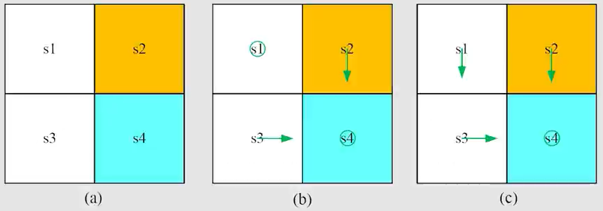

# 第 4 课：值迭代与策略迭代

## 4.1 值迭代算法

实际上在第三章贝尔曼最优公式的求解的步骤和值迭代算法是一致的

### 4.1.1 算法描述

值迭代算法为：

$$
v_{k+1}=f(v_k)=\max_{\pi}(r_{\pi}+\gamma P_{\pi}v_k), \quad k=1,2,3,\ldots
$$

该算法可以分解为以下两个步骤：

**步骤 1：策略更新（Policy Update）**

在给定 $v_k$ 的情况下，求解：

$$
\pi_{k+1}=\arg\max_{\pi}(r_{\pi}+\gamma P_{\pi}v_k)
$$

**步骤 2：价值更新（Value Update）**

根据更新后的策略 $\pi_{k+1}$，计算：

$$
v_{k+1}=r_{\pi_{k+1}}+\gamma P_{\pi_{k+1}}v_k
$$

问题：$v_k$ 是否是某个策略的状态价值函数？（这个问题与4.2章节的序章的第三个问题相关）

不一定。因为无法保证 $v_k$ 满足对应策略的贝尔曼方程。

换言之，$v_k$ 是值迭代过程中对最优状态价值函数 $v^*$ 的近似估计，并不一定是某个策略的真实状态价值函数。

### 4.1.2 策略更新

策略更新公式为：

$$
\pi_{k+1}=\arg\max_{\pi}(r_{\pi}+\gamma P_{\pi}v_k)
$$

将其展开为逐元素形式：

$$
\pi_{k+1}(s)=\arg\max_{\pi}\sum_a\pi(a|s)
\underbrace{\left(
\sum_r p(r|s,a)r
+\gamma\sum_{s'}p(s'|s,a)v_k(s')
\right)}_{q_k(s,a)},
\quad s\in S
$$

其中，$q_k(s,a)$ 表示在当前价值估计 $v_k$ 下，状态 $s$ 中执行动作 $a$ 的动作价值估计。

上述优化问题的一个最优解为：

$$
\pi_{k+1}(a|s)=
\begin{cases}
1, & a=a_k^*(s)\\
0, & a\neq a_k^*(s)
\end{cases}
$$

其中：

$$
a_k^*(s)=\arg\max_a q_k(s,a)
$$

这里假设在存在多个最大动作价值时，从中选取一个动作作为 $a_k^*(s)$。

更新后的策略 $\pi_{k+1}$ 称为**贪婪策略（Greedy Policy）**，因为它在每个状态下直接选择当前动作价值最大的动作。

### 4.1.3 价值更新

价值更新公式为：

$$
v_{k+1}=r_{\pi_{k+1}}+\gamma P_{\pi_{k+1}}v_k
$$

将其展开为逐元素形式：

$$
v_{k+1}(s)=\sum_a\pi_{k+1}(a|s)
\underbrace{\left(
\sum_r p(r|s,a)r
+\gamma\sum_{s'}p(s'|s,a)v_k(s')
\right)}_{q_k(s,a)},
\quad s\in S
$$

由于 $\pi_{k+1}$ 是贪婪策略，因此上述公式可以简化为：

$$
v_{k+1}(s)=\max_a q_k(s,a)
$$

即在每个状态 $s$ 下，选择当前动作价值估计最大的动作，并将其对应的动作价值作为下一次迭代的状态价值估计。

### 4.1.4 例子

考虑一个包含 4 个状态的网格世界，其奖励设置为：

$$
r_{\text{boundary}}=r_{\text{forbidden}}=-1,\quad r_{\text{target}}=1
$$

折扣因子为：

$$
\gamma=0.9
$$

其中：

- $s_1$、$s_2$、$s_3$、$s_4$ 表示网格世界中的四个状态。
- 黄色区域 $s_2$ 为禁止区域。
- 蓝色区域 $s_4$ 为目标区域。
- 智能体碰到边界或进入禁止区域时，获得奖励 $-1$。
- 智能体到达目标区域时，获得奖励 $1$。
- 其他正常移动的奖励为 $0$。

**Q 表：动作价值函数 $q(s,a)$ 的表达式**

Q 表记录了智能体在每个状态 $s$ 下执行不同动作 $a$ 所对应的动作价值。

根据贝尔曼方程：

$$
q(s,a)=r(s,a)+\gamma\sum_{s'}p(s'|s,a)v(s')
$$

对于当前确定性状态转移的网格世界，上式可简化为：

$$
q(s,a)=r(s,a)+\gamma v(s')
$$

其中，$s'$ 为执行动作 $a$ 后到达的下一个状态。

各状态下的动作价值表达式如下：

| 状态  | $a_1$              | $a_2$              | $a_3$              | $a_4$              | $a_5$              |
| ----- | ------------------ | ------------------ | ------------------ | ------------------ | ------------------ |
| $s_1$ | $-1+\gamma v(s_1)$ | $-1+\gamma v(s_2)$ | $\gamma v(s_3)$    | $-1+\gamma v(s_1)$ | $\gamma v(s_1)$    |
| $s_2$ | $-1+\gamma v(s_2)$ | $-1+\gamma v(s_2)$ | $1+\gamma v(s_4)$  | $\gamma v(s_1)$    | $-1+\gamma v(s_2)$ |
| $s_3$ | $\gamma v(s_1)$    | $1+\gamma v(s_4)$  | $-1+\gamma v(s_3)$ | $-1+\gamma v(s_3)$ | $\gamma v(s_3)$    |
| $s_4$ | $-1+\gamma v(s_2)$ | $-1+\gamma v(s_4)$ | $-1+\gamma v(s_4)$ | $\gamma v(s_3)$    | $1+\gamma v(s_4)$  |

其中，$a_1$、$a_2$、$a_3$、$a_4$、$a_5$ 分别表示向上、向右、向下、向左和保持不动。

**注意：** 表中的 $v(s)$ 表示状态价值。当 $v(s)=v^*(s)$ 时，计算得到的 $q(s,a)$ 为最优动作价值函数 $q^*(s,a)$；当 $v(s)$ 为迭代过程中的估计值时，计算得到的则是对应的动作价值估计。

**值迭代示例：第 0 次迭代（$k=0$）**

**1. 初始化状态价值**

令所有状态的初始价值均为 $0$：

$$
v_0(s_1)=v_0(s_2)=v_0(s_3)=v_0(s_4)=0
$$

根据前面给出的动作价值表达式，计算得到初始 Q 表：

| 状态  | $a_1$ | $a_2$ | $a_3$ | $a_4$ | $a_5$ |
| ----- | ----- | ----- | ----- | ----- | ----- |
| $s_1$ | $-1$  | $-1$  | $0$   | $-1$  | $0$   |
| $s_2$ | $-1$  | $-1$  | $1$   | $0$   | $-1$  |
| $s_3$ | $0$   | $1$   | $-1$  | $-1$  | $0$   |
| $s_4$ | $-1$  | $-1$  | $-1$  | $0$   | $1$   |

**2. 步骤 1：策略更新（Policy Update）**

在每个状态下，选择当前动作价值最大的动作，得到贪婪策略 $\pi_1$：

$$
\pi_1(a_5|s_1)=1,\quad
\pi_1(a_3|s_2)=1
$$

$$
\pi_1(a_2|s_3)=1,\quad
\pi_1(a_5|s_4)=1
$$

其中，状态 $s_1$ 下的动作 $a_3$ 和 $a_5$ 具有相同的最大动作价值，此处选择 $a_5$。

更新后的策略如前图（b）所示。

**3. 步骤 2：价值更新（Value Update）**

根据贪婪策略更新状态价值：

$$
v_1(s)=\max_a q_0(s,a)
$$

得到：

$$
v_1(s_1)=0,\quad v_1(s_2)=1
$$

$$
v_1(s_3)=1,\quad v_1(s_4)=1
$$

至此，完成第 0 次迭代，得到更新后的策略 $\pi_1$ 和状态价值估计 $v_1$。

**值迭代示例：第 1 次迭代（$k=1$）**

**1. 更新 Q 表**

由于上一轮迭代得到：

$$
v_1(s_1)=0,\quad v_1(s_2)=1,\quad v_1(s_3)=1,\quad v_1(s_4)=1
$$

将其代入动作价值函数，得到新的 Q 表：

| 状态  | $a_1$             | $a_2$             | $a_3$             | $a_4$             | $a_5$             |
| ----- | ----------------- | ----------------- | ----------------- | ----------------- | ----------------- |
| $s_1$ | $-1+\gamma\cdot0$ | $-1+\gamma\cdot1$ | $\gamma\cdot1$    | $-1+\gamma\cdot0$ | $\gamma\cdot0$    |
| $s_2$ | $-1+\gamma\cdot1$ | $-1+\gamma\cdot1$ | $1+\gamma\cdot1$  | $\gamma\cdot0$    | $-1+\gamma\cdot1$ |
| $s_3$ | $\gamma\cdot0$    | $1+\gamma\cdot1$  | $-1+\gamma\cdot1$ | $-1+\gamma\cdot1$ | $\gamma\cdot1$    |
| $s_4$ | $-1+\gamma\cdot1$ | $-1+\gamma\cdot1$ | $-1+\gamma\cdot1$ | $\gamma\cdot1$    | $1+\gamma\cdot1$  |

**2. 步骤 1：策略更新（Policy Update）**

在每个状态下，选择当前动作价值最大的动作，得到贪婪策略 $\pi_2$：

$$
\pi_2(a_3|s_1)=1,\quad
\pi_2(a_3|s_2)=1
$$

$$
\pi_2(a_2|s_3)=1,\quad
\pi_2(a_5|s_4)=1
$$

更新后的策略如前图（c）所示。

此时，策略已经达到最优，即：

$$
\pi_2=\pi^*
$$

**3. 步骤 2：价值更新（Value Update）**

根据贪婪策略更新状态价值：

$$
v_2(s)=\max_a q_1(s,a)
$$

得到：

$$
v_2(s_1)=\gamma\cdot1
$$

$$
v_2(s_2)=1+\gamma\cdot1
$$

$$
v_2(s_3)=1+\gamma\cdot1
$$

$$
v_2(s_4)=1+\gamma\cdot1
$$

代入 $\gamma=0.9$：

$$
v_2(s_1)=0.9,\quad
v_2(s_2)=v_2(s_3)=v_2(s_4)=1.9
$$

**后续迭代（$k=2,3,\ldots$）**

继续执行策略更新和价值更新，直到相邻两次迭代的状态价值函数之差小于预设阈值：

$$
\|v_{k+1}-v_k\|<\varepsilon
$$

其中，$\varepsilon$ 为预设的收敛阈值。

**注意：** 虽然此时策略已经达到最优，但状态价值函数尚未完全收敛至最优状态价值函数 $v^*$，因此仍需继续进行价值迭代。

## 4.2 策略迭代算法

### 序章

在开始学习策略迭代算法之前，我们需要先回答几个问题

**问题 1：在策略评估步骤中，如何通过求解贝尔曼方程获得状态价值函数？**

在策略评估（Policy Evaluation）过程中，需要求解当前策略 $\pi_k$ 对应的贝尔曼方程：

$$
v_{\pi_k}=r_{\pi_k}+\gamma P_{\pi_k}v_{\pi_k}
$$

主要有以下两种求解方法。

**1. 闭式解（Closed-form Solution）**

通过矩阵运算，可以直接求得状态价值函数：

$$
v_{\pi_k}=(I-\gamma P_{\pi_k})^{-1}r_{\pi_k}
$$

其中，$I$ 为单位矩阵。

**2. 迭代解（Iterative Solution）**

给定初始状态价值估计 $v_{\pi_k}^{(0)}$，通过以下公式反复迭代：

$$
v_{\pi_k}^{(j+1)}
{}=
r_{\pi_k}+\gamma P_{\pi_k}v_{\pi_k}^{(j)},
\quad j=0,1,2,\ldots
$$

随着迭代次数增加，$v_{\pi_k}^{(j)}$ 逐渐收敛至当前策略对应的状态价值函数 $v_{\pi_k}$。

上述两种求解方法已在贝尔曼方程相关章节中介绍。

**注意：策略迭代是一个在策略评估步骤中嵌套了另一个迭代算法的迭代算法！**

- 外层迭代：交替执行策略评估和策略改进，不断更新策略 $\pi_k$。
- 内层迭代：在策略评估过程中，保持策略 $\pi_k$ 不变，通过迭代求解其对应的状态价值函数 $v_{\pi_k}$。

**问题 2：在策略改进步骤中，为什么新策略 $\pi_{k+1}$ 优于原策略 $\pi_k$？**

**引理：策略改进（Policy Improvement）**

如果新策略 $\pi_{k+1}$ 满足：

$$
\pi_{k+1}
{}=
\arg\max_{\pi}
\left(
r_{\pi}+\gamma P_{\pi}v_{\pi_k}
\right)
$$

那么，对于任意迭代次数 $k$，都有：

$$
\boxed{v_{\pi_{k+1}}\geq v_{\pi_k}}
$$

其中，不等式是逐元素成立的，即对于任意状态 $s\in S$：

$$
v_{\pi_{k+1}}(s)\geq v_{\pi_k}(s)
$$

这表明，经过策略改进后，新策略在所有状态下的状态价值均不会低于原策略。

**问题 3：为什么策略迭代算法最终能够收敛至最优策略？**

由于每次迭代都会改进策略，因此有：

$$
v_{\pi_0}\leq v_{\pi_1}\leq v_{\pi_2}\leq\cdots\leq v_{\pi_k}\leq\cdots\leq v^*
$$

因此，状态价值函数序列 $\{v_{\pi_k}\}$ 单调递增且具有上界，必然收敛。

但是，还需要进一步证明该序列最终收敛至最优状态价值函数 $v^*$。

**定理：策略迭代的收敛性（Convergence of Policy Iteration）**

策略迭代算法生成的状态价值函数序列 $\{v_{\pi_k}\}_{k=0}^{\infty}$ 收敛至最优状态价值函数 $v^*$：

$$
\boxed{\lim_{k\to\infty}v_{\pi_k}=v^*}
$$

因此，在有限状态和有限动作空间等标准条件下，策略迭代算法最终能够获得最优策略。

学习到这的时候我一直有个误区：策略迭代需要通过策略评估，算出当前策略对应的状态价值，而值迭代却直接选取最大的动作价值，作为新的状态价值。这看起来就像是值迭代跳过了策略评估，直接算出了新策略的状态价值。

但问题恰恰出在这里：值迭代算出来的并不是新策略真正的状态价值，而只是根据上一轮的价值估计更新出来的结果。

**一、我之前理解的值迭代流程，究竟哪里不一样？**

我认为值迭代的过程是：

1. 已知旧状态价值 $V_k$。
2. 计算所有动作价值 $Q_k(s,a)$。
3. 选择最大动作价值对应的动作，得到新策略 $\pi_{k+1}$。
4. 用新策略对应的动作价值直接得到新的状态价值 $V_{k+1}$。

从计算过程来看，这样理解没有问题。

但在最后一步中，实际上隐含了一个假设：

$$
\boxed{
V_{k+1}(s)=V^{\pi_{k+1}}(s)
}
$$

即认为更新得到的 $V_{k+1}$，就是执行新策略 $\pi_{k+1}$ 时对应的真实状态价值。

**这个等式一般不成立。**

我们先从动作价值的定义来看为什么。

---

**二、最关键的区别：计算动作价值时，使用的是谁的状态价值？**

假设当前有一个状态价值估计 $V_k(s)$。

值迭代首先计算：

$$
Q_k(s,a)=r(s,a)+
\gamma\sum_{s'}P(s'|s,a)V_k(s')
$$

然后选择最大动作价值：

$$
\pi_{k+1}(s)
=\arg\max_a Q_k(s,a)
$$

接着得到：

$$
\begin{aligned}
V_{k+1}(s)
&=\max_a Q_k(s,a)\\
&=r(s,\pi_{k+1}(s))\\
&\quad+\gamma\sum_{s'}
P(s'|s,\pi_{k+1}(s))V_k(s')
\end{aligned}
$$

注意最后这个公式。

**虽然当前动作已经按照新策略 $\pi_{k+1}$ 选择，但是后续状态的价值仍然使用旧的估计 $V_k$。**

那么，真正执行新策略时，它的状态价值应该是多少？

根据贝尔曼期望方程：

$$
\boxed{
\begin{aligned}
V^{\pi_{k+1}}(s)
&=r(s,\pi_{k+1}(s))\\
&\quad+\gamma\sum_{s'}
P(s'|s,\pi_{k+1}(s))
V^{\pi_{k+1}}(s')
\end{aligned}
}
$$

对比一下：

**1. 值迭代**
$$
\begin{aligned}
V_{k+1}(s)
&=r(s,\pi_{k+1}(s))\\
&\quad+\gamma\sum_{s'}P(s'|s,\pi_{k+1}(s))
\underbrace{V_k(s')}_{\text{旧价值估计}}
\end{aligned}
$$

使用旧的价值估计计算新策略所选动作的价值，只进行一次贝尔曼更新。

**2. 策略迭代中的策略评估**
$$
\begin{aligned}
V^{\pi_{k+1}}(s)
&=r(s,\pi_{k+1}(s))\\
&\quad+\gamma\sum_{s'}P(s'|s,\pi_{k+1}(s))
\underbrace{V^{\pi_{k+1}}(s')}_{\text{新策略的真实价值}}
\end{aligned}
$$

求解新策略对应的贝尔曼期望方程，得到持续执行该策略时的真实状态价值。

所以，值迭代虽然可以直接更新状态价值，但是它更新的是一个估计值，并没有真正计算新策略的完整状态价值。

**这就是省略完整策略评估所带来的差别。**

---

**三、为什么策略迭代能够保证新策略更好，而值迭代不行？**

现在我们可以直接从两个算法的数学公式中找出原因。

**1. 策略迭代：每次都以旧策略的真实价值为依据**

假设当前策略是 $\pi_k$。

通过完整的策略评估，我们已经知道：

$$
V^{\pi_k}(s)
$$

也就是持续执行旧策略所能获得的真实期望累计奖励。

随后，我们根据这个价值函数计算动作价值：

$$
Q^{\pi_k}(s,a)
{}=
r(s,a)+\gamma\sum_{s'}
P(s'|s,a)V^{\pi_k}(s')
$$

再选择新动作：

$$
\pi_{k+1}(s)=
\arg\max_a Q^{\pi_k}(s,a)
$$

因此，必然有：

$$
Q^{\pi_k}(s,\pi_{k+1}(s))
\geq V^{\pi_k}(s)
$$

这个不等式的含义非常明确：

在每一个状态下，选择新策略所指定的动作，然后继续执行旧策略，其价值都不低于完全执行旧策略。

由于每个状态都满足这个关系，可以不断将后续状态的旧策略价值替换为新策略选定动作的价值，最终得到：

$$
\boxed{
V^{\pi_{k+1}}(s)
\geq V^{\pi_k}(s),
\quad \forall s
}
$$

这就是策略改进定理。

**保证策略改善的关键，并不是选择最大动作价值这一操作本身，而是计算动作价值时，使用的是旧策略经过完整评估后得到的真实状态价值。**

**2. 值迭代：最大动作价值是根据旧的价值估计计算的**

值迭代中，我们知道：

$$
V_{k+1}(s)=\max_a Q_k(s,a)
$$

因此，可以得到：

$$
Q_k(s,\pi_{k+1}(s))
\geq Q_k(s,\pi_k(s))
$$

但是，这里比较的是基于同一个价值估计 $V_k$ 计算出来的动作价值。

它并不意味着：

$$
V^{\pi_{k+1}}(s)
\geq V^{\pi_k}(s)
$$

因为 $V_k$ 通常并不等于旧策略的真实价值：

$$
V_k\neq V^{\pi_k}
$$

可以把它理解为：

策略迭代是在准确评估旧策略的基础上进行改进；值迭代则是在不断更新的价值估计上选择动作。

由于估计值不一定等于相应策略的真实价值，所以两次贪心选择之间没有必然的策略改善关系。

**总结：策略迭代的每一次策略改进，都建立在旧策略的真实价值之上；而值迭代的每一次贪心选择，建立在尚未收敛的价值估计之上。前者可以利用策略改进定理保证新策略的真实价值不下降，后者通常没有这一保证。**

### 4.2.1 算法描述

给定一个随机初始策略 $\pi_0$，策略迭代算法包含以下两个步骤：

**步骤 1：策略评估（Policy Evaluation, PE）**

计算当前策略 $\pi_k$ 对应的状态价值函数：

$$
v_{\pi_k}=r_{\pi_k}+\gamma P_{\pi_k}v_{\pi_k}
$$

注意，$v_{\pi_k}$ 是策略 $\pi_k$ 对应的真实状态价值函数，满足该策略的贝尔曼方程。

**步骤 2：策略改进（Policy Improvement, PI）**

根据当前策略的状态价值函数 $v_{\pi_k}$，更新策略：

$$
\pi_{k+1}=\arg\max_{\pi}(r_{\pi}+\gamma P_{\pi}v_{\pi_k})
$$

其中，最大化操作是逐元素进行的，即对每个状态分别选择使动作价值最大的策略。

重复执行策略评估和策略改进，直到策略不再发生变化。

### 4.2.2 策略评估

策略评估的目的是计算当前策略 $\pi_k$ 对应的状态价值函数 $v_{\pi_k}$。

**（1）矩阵-向量形式**

通过以下迭代公式计算：

$$
v_{\pi_k}^{(j+1)}
{}=
r_{\pi_k}+\gamma P_{\pi_k}v_{\pi_k}^{(j)},
\quad j=0,1,2,\ldots
$$

其中，$j$ 表示策略评估过程中的迭代次数，$\pi_k$ 在整个策略评估过程中保持不变。

**（2）逐元素形式**

$$
v_{\pi_k}^{(j+1)}(s)
{}=
\sum_a\pi_k(a|s)
\left(
\sum_r p(r|s,a)r
{}+
\gamma\sum_{s'}p(s'|s,a)v_{\pi_k}^{(j)}(s')
\right),
\quad s\in S
$$

**（3）停止条件**

当满足以下任一条件时，可以停止策略评估：

- $j\rightarrow\infty$，理论上迭代至完全收敛。
- 迭代次数 $j$ 足够大。
- 相邻两次迭代的价值函数变化足够小，即：

$$
\left\|
v_{\pi_k}^{(j+1)}-v_{\pi_k}^{(j)}
\right\|<\varepsilon
$$

其中，$\varepsilon$ 为预设的收敛阈值。

迭代收敛后，即可得到当前策略 $\pi_k$ 对应的状态价值函数 $v_{\pi_k}$。

### 4.2.3 策略改进

策略改进的目的是根据当前策略 $\pi_k$ 的状态价值函数 $v_{\pi_k}$，获得改进后的策略 $\pi_{k+1}$。

**（1）矩阵-向量形式**
$$
\pi_{k+1}
{}=
\arg\max_{\pi}
\left(
r_{\pi}+\gamma P_{\pi}v_{\pi_k}
\right)
$$

**（2）逐元素形式**

$$
\pi_{k+1}(s)
{}=
\arg\max_{\pi}
\sum_a\pi(a|s)
\underbrace{
\left(
\sum_r p(r|s,a)r
{}+
\gamma\sum_{s'}p(s'|s,a)v_{\pi_k}(s')
\right)
}_{q_{\pi_k}(s,a)},
\quad s\in S
$$

其中，$q_{\pi_k}(s,a)$ 表示在状态 $s$ 下执行动作 $a$，随后遵循策略 $\pi_k$ 时的动作价值函数。

定义：

$$
a_k^*(s)=\arg\max_a q_{\pi_k}(s,a)
$$

这里假设当多个动作具有相同的最大动作价值时，从中选择一个动作作为 $a_k^*(s)$。

则改进后的贪婪策略为：

$$
\pi_{k+1}(a|s)=
\begin{cases}
1, & a=a_k^*(s)\\
0, & a\neq a_k^*(s)
\end{cases}
$$

该策略在每个状态下选择当前动作价值最大的动作，因此称为**贪婪策略（Greedy Policy）**。

## 4.3 截断式策略迭代算法

这个算法是对 **值迭代算法** 和 **策略迭代算法** 一般化的推广

### 4.3.1 值迭代和策略迭代的比较

**1. 策略迭代（Policy Iteration）**

从初始策略 $\pi_0$ 开始，交替执行以下两个步骤：

- **步骤 1：策略评估（Policy Evaluation, PE）**

$$
v_{\pi_k}=r_{\pi_k}+\gamma P_{\pi_k}v_{\pi_k}
$$

- **步骤 2：策略改进（Policy Improvement, PI）**

$$
\pi_{k+1}=\arg\max_{\pi}\left(r_{\pi}+\gamma P_{\pi}v_{\pi_k}\right)
$$

**2. 值迭代（Value Iteration）**

从初始状态价值估计 $v_0$ 开始，交替执行以下两个步骤：

- **步骤 1：策略更新（Policy Update, PU）**

$$
\pi_{k+1}=\arg\max_{\pi}\left(r_{\pi}+\gamma P_{\pi}v_k\right)
$$

- **步骤 2：价值更新（Value Update, VU）**

$$
v_{k+1}=r_{\pi_{k+1}}+\gamma P_{\pi_{k+1}}v_k
$$

**核心区别：**

策略迭代需要在每次策略评估中求解当前策略对应的贝尔曼方程，得到该策略的状态价值函数 $v_{\pi_k}$，再进行策略改进。

值迭代则不需要完整求解当前策略对应的状态价值函数，而是直接根据当前价值估计 $v_k$ 进行一次贝尔曼最优更新，不断逼近最优状态价值函数 $v^*$。

### 4.3.2 策略迭代与值迭代的执行流程对比

两种算法的执行流程非常相似。

**1. 策略迭代（Policy Iteration）**

$$
\pi_0
\xrightarrow{\mathrm{PE}}
v_{\pi_0}
\xrightarrow{\mathrm{PI}}
\pi_1
\xrightarrow{\mathrm{PE}}
v_{\pi_1}
\xrightarrow{\mathrm{PI}}
\pi_2
\xrightarrow{\mathrm{PE}}
v_{\pi_2}
\xrightarrow{\mathrm{PI}}
\cdots
$$

**2. 值迭代（Value Iteration）**

$$
v_0
\xrightarrow{\mathrm{PU}}
\pi_1
\xrightarrow{\mathrm{VU}}
v_1
\xrightarrow{\mathrm{PU}}
\pi_2
\xrightarrow{\mathrm{VU}}
v_2
\xrightarrow{\mathrm{PU}}
\cdots
$$

其中：

- PE（Policy Evaluation）：策略评估。
- PI（Policy Improvement）：策略改进。
- PU（Policy Update）：策略更新。
- VU（Value Update）：价值更新。

### 4.3.3 策略迭代与值迭代的详细对比

下面进一步比较两种算法的具体执行步骤。

| 步骤     | 策略迭代（Policy Iteration）                            | 值迭代（Value Iteration）                                 | 说明                             |
| -------- | ------------------------------------------------------- | --------------------------------------------------------- | -------------------------------- |
| 1. 策略  | $\pi_0$                                                 | 无                                                        | 策略迭代从初始策略开始           |
| 2. 价值  | $v_{\pi_0}=r_{\pi_0}+\gamma P_{\pi_0}v_{\pi_0}$         | $v_0:=v_{\pi_0}$                                          | 设置相同的初始状态价值           |
| 3. 策略  | $\pi_1=\arg\max_{\pi}(r_{\pi}+\gamma P_{\pi}v_{\pi_0})$ | $\tilde{\pi}_1=\arg\max_{\pi}(r_{\pi}+\gamma P_{\pi}v_0)$ | 两种算法得到相同的策略           |
| 4. 价值  | $v_{\pi_1}=r_{\pi_1}+\gamma P_{\pi_1}v_{\pi_1}$         | $v_1=r_{\tilde{\pi}_1}+\gamma P_{\tilde{\pi}_1}v_0$       | $v_{\pi_1}\geq v_1$              |
| 5. 策略  | $\pi_2=\arg\max_{\pi}(r_{\pi}+\gamma P_{\pi}v_{\pi_1})$ | $\tilde{\pi}_2=\arg\max_{\pi}(r_{\pi}+\gamma P_{\pi}v_1)$ | 根据各自更新后的价值函数改进策略 |
| $\vdots$ | $\vdots$                                                | $\vdots$                                                  | $\vdots$                         |

**对比分析：**

1. 两种算法从相同的初始状态价值开始。
2. 前三个步骤相同，因此第一次策略更新得到的策略相同，即 $\pi_1=\tilde{\pi}_1$。
3. 从第四个步骤开始，两种算法出现差异：
   - **策略迭代：** 需要求解新策略 $\pi_1$ 对应的贝尔曼方程，获得该策略的真实状态价值函数 $v_{\pi_1}$。通常需要通过内层迭代计算至收敛。
   - **值迭代：** 只进行一次价值更新，直接利用上一轮的状态价值估计 $v_0$ 计算 $v_1$，不需要完整求解新策略对应的贝尔曼方程。

因此，两种算法的核心区别在于：**策略迭代在每次策略改进后进行完整的策略评估，而值迭代仅执行一次贝尔曼价值更新。**

### 4.3.4 值迭代、截断策略迭代与策略迭代的关系

考虑求解策略 $\pi_1$ 对应的贝尔曼方程：

$$
v_{\pi_1}=r_{\pi_1}+\gamma P_{\pi_1}v_{\pi_1}
$$

给定初始状态价值估计：

$$
v_{\pi_1}^{(0)}=v_0
$$

通过以下迭代公式进行策略评估：

$$
v_{\pi_1}^{(1)}
{}=
r_{\pi_1}+\gamma P_{\pi_1}v_{\pi_1}^{(0)}
$$

$$
v_{\pi_1}^{(2)}
{}=
r_{\pi_1}+\gamma P_{\pi_1}v_{\pi_1}^{(1)}
$$

$$
\vdots
$$

$$
v_{\pi_1}^{(j)}
{}=
r_{\pi_1}+\gamma P_{\pi_1}v_{\pi_1}^{(j-1)}
$$

$$
\vdots
$$

$$
v_{\pi_1}^{(\infty)}
{}=
r_{\pi_1}+\gamma P_{\pi_1}v_{\pi_1}^{(\infty)}
$$

根据策略评估的迭代次数，可以得到三种不同的算法：

**1. 值迭代（Value Iteration）**

仅执行一次策略评估：

$$
v_1=v_{\pi_1}^{(1)}
$$

**2. 截断策略迭代（Truncated Policy Iteration）**

执行有限次策略评估（$j$ 次），然后进行下一轮策略改进：

$$
\bar{v}_1=v_{\pi_1}^{(j)}
$$

**3. 策略迭代（Policy Iteration）**

执行完整的策略评估，直到状态价值函数收敛至当前策略对应的真实状态价值函数：

$$
v_{\pi_1}=v_{\pi_1}^{(\infty)}
$$

**总结：** 三种算法的主要区别在于每轮策略更新后执行的策略评估次数。值迭代仅执行一次，截断策略迭代执行有限次，而标准策略迭代则执行完整的策略评估。

### 4.3.5 截断策略迭代是否会影响算法的收敛性？

**命题：价值改进（Value Improvement）**

考虑策略评估过程中的迭代算法：

$$
v_{\pi_k}^{(j+1)}
{}=
r_{\pi_k}+\gamma P_{\pi_k}v_{\pi_k}^{(j)},
\quad j=0,1,2,\ldots
$$

如果初始状态价值估计选择为上一轮策略对应的状态价值函数：

$$
v_{\pi_k}^{(0)}=v_{\pi_{k-1}}
$$

那么，对于任意 $j=0,1,2,\ldots$，均有（注意这里是同一个策略，而在值迭代中，之所以不能保证是因为比较的是不同策略的状态价值）：

$$
\boxed{
v_{\pi_k}^{(j+1)}\geq v_{\pi_k}^{(j)}
}
$$

即在上述初始条件下，策略评估过程中每次迭代得到的状态价值估计都不会低于上一次迭代的结果。

因此，即使提前截断策略评估过程，也可以保证截断前的每次价值更新均具有单调不减的性质。
